# 心智探秘 · 第 2 讲：意识

**课程**：心智探秘（清华大学高水平通识课特选课堂）  
**主讲**：刘嘉（清华大学基础科学讲席教授）  
**时间**：2026-09-24 周四 19:00-21:49（回放时长 2 小时 49 分）  
**整理来源**：雨课堂课堂回顾逐字稿 + 84 页课堂幻灯片 + 知识导引  
**主题**：意识（consciousness），心理学最核心的概念

> **一句话主旨**：意识让我们从「趋利避害的野兽」进化成「追问意义的超人」；它放大我们的存在感、滋养自我价值、让我们超越对死亡的恐惧；自由意志在物理世界可能是幻觉，在心理世界却是全部。

---

## 逻辑脉络：这一讲是怎么推过来的

这堂课的论证像一根链条，从「我是谁」一路扣到「什么是意识」：

1. **抛出锚点**：意识是心理学最核心的概念（类比物理的「存在」、数学的「数字」）。
2. **转入终极三问**：我是谁 / 从哪来 / 到哪去，其中「我是谁」最根本，因为前两问都需要一个主语「我」。
3. **把「我是谁」换成「生与死」**：从哈姆雷特的「生存还是毁灭」到现代医学对死亡的重新定义。
4. **划出意识的边界**：植物人、脑死亡、被囚禁的灵魂，证明意识比肉体更接近「我」。
5. **拆解意识本身**：河流（感知）与桥上的人（反省），谁有意识（猫、毛毛虫、大模型、塑料网），以及它为何极端私有、不可测量。
6. **从抽象落到可研究的属性**：控制（延迟满足）、自由意志。
7. **用实验冲击直觉**：棉花糖实验、白熊实验、脑电实验，一层层证明「控制是有限的」「自由意志可能是幻觉」。
8. **引入两把钥匙**：尼采的「超人与野兽」、弗洛伊德的「冰山与防御机制」，解释人如何从野兽走向超人。
9. **落到升华**：达芬奇、蒙娜丽莎、勃艮第葡萄酒，说明痛苦如何转化为创造。
10. **回收到意识的功能**：孔雀的尾巴（意识让我们爱上自己）、存在感、自我价值、超越死亡。
11. **终章设问**：什么是意识？用磁铁与铁粉的比喻作答，物理世界里自由意志是 nothing，心理世界里是 everything。

**贯穿全课的一条主线**：人的内心既有「野兽」（本能、欲望、潜意识），也有「超人」（理性、道德、意识）；两者的和解方式不是零和搏斗，而是**升华**。意识的本质不是让你「想拿水杯就拿水杯」，而是让你**爱上你自己**。

---

## 01 开场：意识是心理学最核心的概念

`00:20:54` - `00:24:22` ｜ 课件 `slide-01` - `slide-05`

正式开讲前，刘嘉先处理两件事务：请同学们收起笔记本电脑（「你完全不用它，你就听我讲」），并为教室容量道歉，选课同学优先，旁听同学七点后入场。他还开了个玩笑活跃气氛：这门课若在商业机构完整听下来要花十万左右，「你现在坐地上、站着硬撑三小时，等于挣了七八千，带着挣钱的心态来听课就行」。

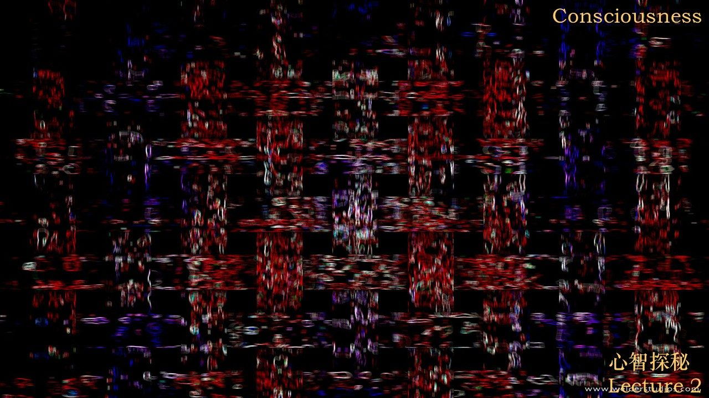

切入正题。这堂课的主题是 **consciousness（意识）**，它是心理学里**最核心的概念**。刘嘉用了一个类比来定位它的分量：

> 物理学最核心的概念是「存在」，物理学不可能讨论一个不存在的东西；数学最核心的概念是「数字」；那么心理学最核心的概念，就是**意识**。

他强调这堂课的分量：「如果你把今天这堂课听明白了，后面哪怕坐地上、站在后面听，也都值了。」

为什么要讲意识？故事从「进清华校门」说起。外校旁听同学进校门要过保安这一关，而国内最早把开放大学封闭起来的是北大。保安会问你三个问题：**你是谁？从哪儿来？到哪儿去？** 刚觉得保安讨厌，慢慢就听出了哲学味道，这不正是我们一辈子都在回答的问题吗？这就是**人类的终极三问**。

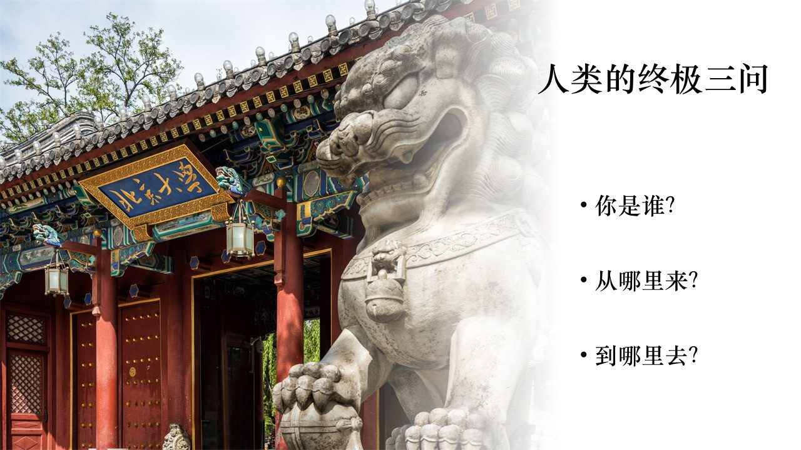

- **从哪里来**：从物理学看，是宇宙如何诞生、时空如何展开；从生物学看，是 35 亿年前第一个细胞如何从无到有。
- **到哪里去**：从哲学看，是人类的归途；从社会看，是文明如何演化、AI 超越人类后人还是不是文明的棋手。
- **我是谁**：这是最根本的一问。因为「从哪来」「到哪去」都需要一个**主语「我」**，当我不存在，大爆炸无所谓，未来也无所谓。所以「我」才是最关键的。

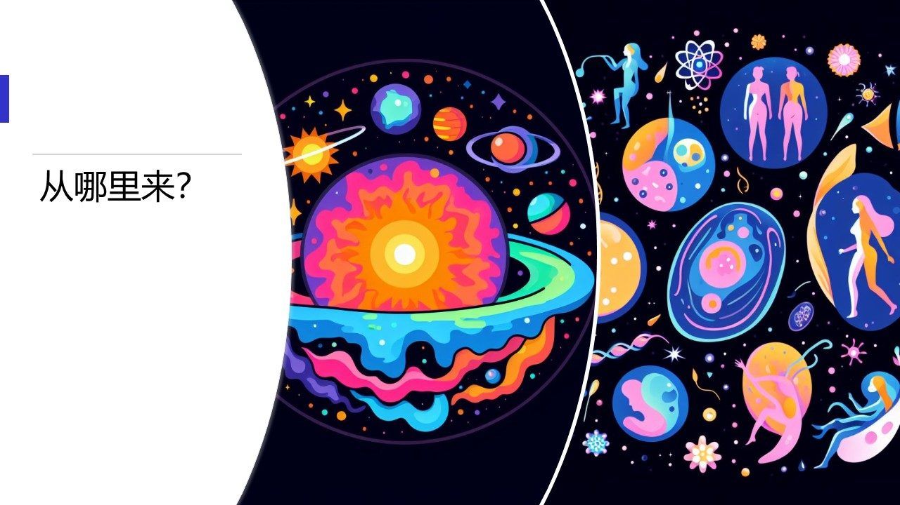 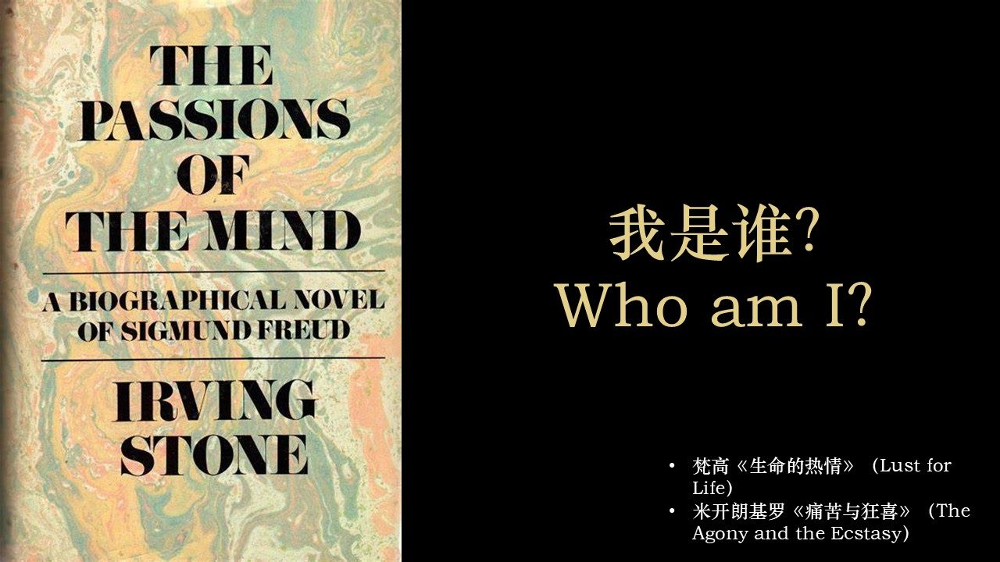

**本节要点**
- 意识是心理学最核心的概念，相当于物理的「存在」、数学的「数字」。
- 人类终极三问：我是谁、从哪来、到哪去。
- 「我是谁」最根本，因为它是另外两问的主语。

---

## 02 从误入心理系到「我是谁」：一个保送生的岔路

`00:24:22` - `00:28:18` ｜ 叙事

这一节是刘嘉的自述，解释他为什么从物理走向心理。

高中时他参加数理化竞赛拿到保送资格，可以任选专业。他当时的判断很朴素：数学太难、化学太简单（「跟文科差不多」），于是选了**物理**，想弄清楚「我们从哪里来」，宇宙的浩瀚是值得研究的问题。志愿就这么填上去了。

结果通知书下来，录的不是物理系，而是**心理系**。一个来自五六线城市的 90 年代孩子，根本不知道心理学是啥，莫名其妙收到去心理系报到的通知。他带着通知书在信阳陆军学院军训（那时要训整整一年），找到北大老师说「我是保送生，该读物理」。老师看了一下说「对不起，写错一个字，等你回北大再改，反正军训在哪儿都一样」。

那一年军训他没事干，就琢磨「心理学到底是什么鬼」，正好找到一本书，欧文·斯通的**《心灵的激情》**（一部写弗洛伊德生平的传记小说）。看完他觉得「这比物理有意思多了」，因为这本书既没讲宇宙起源，也没讲文明，而是讲**「我是谁」**。回到北大后，他就没再去找老师改专业，留在心理系拿到了本科学位。

> 严格官方意义上讲我不是心理系的，但我在心理系拿到了本科学位。（刘嘉）

**本节要点**
- 刘嘉因保送通知书误写，从物理系进入心理系。
- 军训期间读《心灵的激情》（写弗洛伊德），被「我是谁」这一问打动。
- 从此留在心理学，尽管当时所有老师都说「弗洛伊德是伪科学」。

---

## 03 死亡的边界：从哈姆雷特到植物人

`00:28:48` - `00:42:29` ｜ 课件 `slide-06` - `slide-12`

「我是谁」很难回答，但可以把它换算成**生与死**：你死了就不再是你，活着的才是你。于是先问：什么是死？

### 哈姆雷特：生存还是毁灭

这是人类历史上最著名的戏剧场景。哈姆雷特说出了文学史上最著名的一句话：

> To be, or not to be, that is the question.（生存还是毁灭，这是一个问题。）

刘嘉现场播放了几位经典莎士比亚演员的演绎版本，让大家注意他们**重音放在哪里**，同一个「to be or not to be」，重音位置不同，对生与死的关注点就不同。

### 传统死亡定义被现代医学推翻

什么叫死？传统说法是心不跳、不呼吸了，「小说里吐出最后一口气，这人嗝屁了」。但现代医学有了 **ECMO（体外膜肺氧合）**：心肺不工作了，可以在体外「外挂」一个心脏和肺，替你维持循环和呼吸，甚至从死神手里抢救回来。所以「心不跳、不呼吸」已经不能定义死亡。

如果肉体定义不了死，那就看精神，**大脑死亡**，才是真的死。

 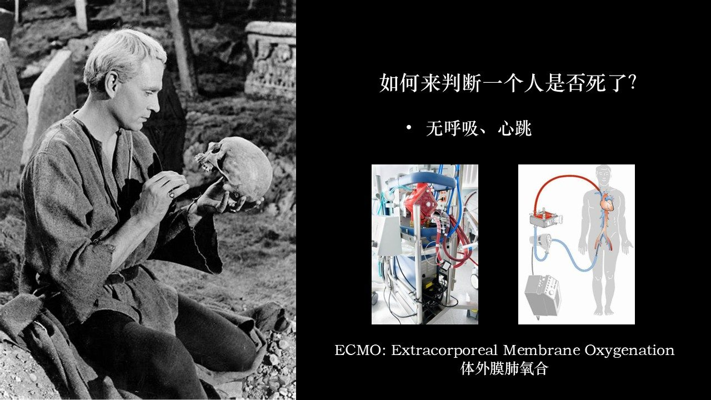

### 植物人：活着的肉体，缺席的意识

一个骑摩托车撞到电线杆的小伙子，头上撞凹一块，躺在病床上一动不动，这种状态叫**植物人**。肉体活着，但没有精神。判断依据有三条：

1. **能进行物质与能量代谢**：能呼吸、心跳、血压正常，头发、指甲还会长。
2. **有本能神经反应**：会咳嗽、打哈欠。
3. **认知能力完全丧失**：感知觉、思维、主动行为全无，脑电图是杂乱的，不像正常人有规律波形。

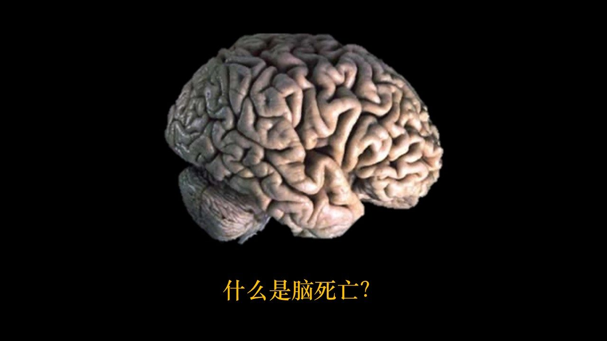 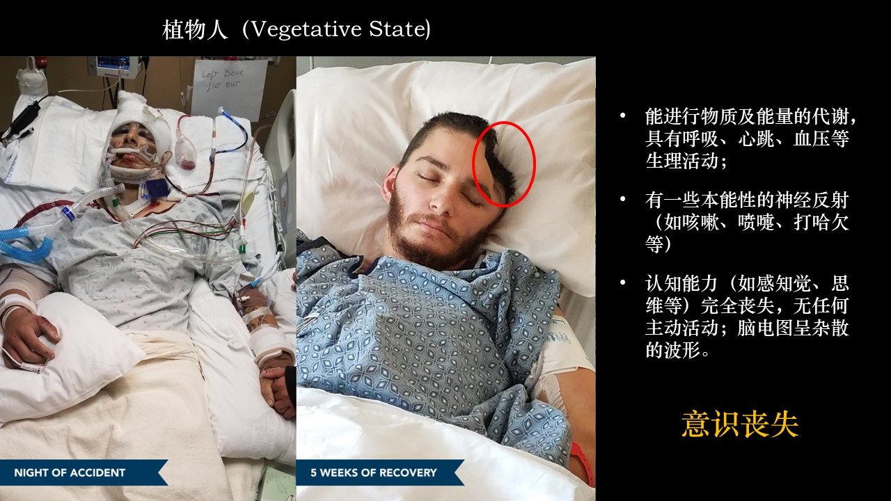

这时出现一个医学伦理难题：他可能躺十年、二十年，只要给足营养就能一直活下去。人类**不需要大脑也能活下去，不需要意识也能活下去**。那么，我们是该让他有尊严地走，还是维持这种状态？如果躺在病床上的是你深爱的人，医生问你「拔不拔管」，你怎么决定？

### 磁共振实验：被囚禁的灵魂

刘嘉先讲了一个关键实验。把人放进磁共振扫描仪，让他**想象**自己在打网球，他的运动辅助区（SMA）会亮；让他想象在自己家里走动（卧室到客厅到厨房），运动皮层不亮，而表征空间的区域（海马旁回 PPA）会亮。也就是说，**通过大脑激活，能知道一个人此刻在想什么**。

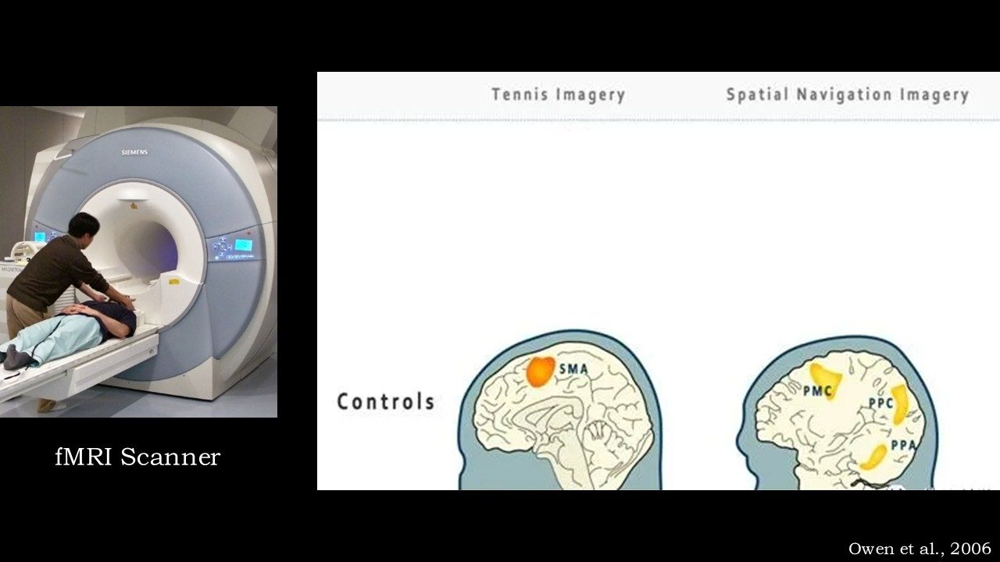

一位英国心理学家把这个实验用在了被诊断为植物人、可以拔管的深度昏迷患者身上：对着他们说「请你想象在打网球」「想象在你家里走来走去」，观察大脑是否激活。结果令人震惊，**有些植物人（不是全部）的大脑激活，和正常人无法区分**。也就是说，他们对外界毫无反应，却能听见声音并做出反应，像被关进牢笼：你听不见他们的呼喊，他们却能感知整个外界。

### 《潜水钟与蝴蝶》：身体被囚，思想飞翔

这引出一个真实故事。一位时尚杂志主编脑干中风，全身瘫痪，只剩左眼能眨。但他的大脑完好，只是脑干中感知运动的区域受损。助手念 26 个字母，念到他要的字母时他眨一下眼，就用这种方式一个字母一个字母写出了《潜水钟与蝴蝶》。

> 我的身体像潜水钟一样被禁锢，但我的思想能像蝴蝶一样自由飞翔。当喧嚣退去，我听见蝴蝶飞过我脑海的声音，必须非常专心才能听见，蝴蝶翕动的翅膀几乎无法感知，稍微用力一点呼吸就可能掩盖它。（《潜水钟与蝴蝶》）

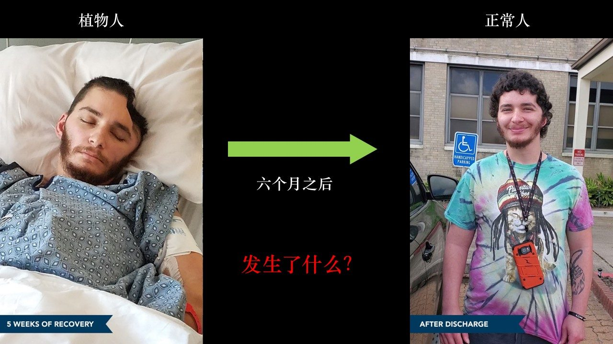

刘嘉说自己曾去天坛医院（国内看意识障碍最好的地方）参观植物人病房，回来就对亲人说：「只要我丧失了意识、被判断是植物人，一定不要保留，把管拔了。」因为对他来说，**比死更恐怖的是自由的灵魂被囚禁在一个潜水钟里，能听见、能思考，却不能做出任何反应**。

回到那个昏迷的小伙子：家人选择了**不拔管**。六个月后一个清晨，他睁开了眼睛。

**本节要点**
- 传统死亡定义（心肺停止）被 ECMO 推翻，转向以「脑死亡」定义死亡。
- 植物人有代谢与本能反应，但认知、主动行为、规律脑电全部丧失。
- 磁共振实验显示部分植物人仍有意识活动，像被囚禁在牢笼里。
- 《潜水钟与蝴蝶》证明「身体被囚、思想仍可自由」。
- 刘嘉个人立场：若成植物人，宁可拔管；但真实案例里家人不拔管，患者六月后苏醒。

---

## 04 意识的两层：河流与桥上的观察者

`00:42:32` - `00:44:20` ｜ 课件 `slide-13`

现代心理学之父威廉·詹姆斯给了一个绝妙比喻。想象一幅图：一条河在不停流动。

- **第一层：感知（awareness）**。河水白天黑夜都在流。哪怕你入睡、深度睡眠，外部信息照样进入大脑，河流一直在流动。除非进入植物态或深度麻醉，这条河才会停。这是意识比较低的层次，叫**觉知/主观经验（awareness）**。
- **第二层：反省（consciousness）**。桥上站着一个人，有时在桥上，有时不在。无论这个人在不在，河水都在流。但当这个人**去反省内心河流的流动**，「眼睛像翻转 180 度，回头看自己」，这才是高级层面的意识，也就是真正意义上的 **consciousness**。

日常经验里就有它：上课走神时河水照样流（否则你听不见老师叫你），可老师一点名，你「马上回到桥上」，「老师我在这儿，专心听课，啥都没干」。

**本节要点**
- 意识有两层：低层是感知（awareness，河水流动），高层是反省（consciousness，桥上的人）。
- 河水流动不依赖桥上的人；桥上的人是对流动的「自我观察」。

---

## 05 谁拥有意识：从猫到大模型到塑料网

`00:44:20` - `00:53:20` ｜ 课件 `slide-14` - `slide-18`

桥上这个人是谁？谁拥有意识？我们能确定自己有意识，却很难证明旁边的人有意识。问题随生物复杂度一路追问：

- **猫有意识吗？** 现场相当一部分人举手（刘嘉打趣：你们大概率是养猫的。他说自己是四川人，原本爱吃兔肉，养猫后就再也不吃了，因为「兔腿和猫腿摸起来感觉差不多」）。
- **毛毛虫呢？** 举手的人少很多。「你们为什么歧视毛毛虫？人家也有神经元好吗？」那多少个神经元才算有意识？，这个问题先留着。

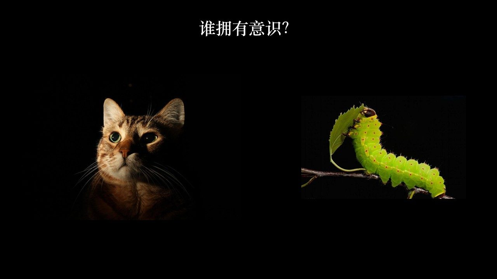

### 大模型有意识吗

2022 年 10 月 30 日 ChatGPT 问世。大模型（ChatGPT、豆包、通义……）有意识吗？多数人说没有。但有人认为有：

- **伊利亚·苏茨克维（Ilya Sutskever）**，GPT 之父、OpenAI 前首席科学家，2022 年 2 月在推特发文：「现在的大型神经网络已经有了一丝的意识（slightly conscious）。」别人问他感受到了什么，他不再回复。这成了他与 OpenAI 创始人**萨姆·奥特曼**分道扬镳的关键，他认为再发展下去大模型将不可遏制，必须把更多精力放在安全上，因为「我从大模型上已经看见了意识」；奥特曼说他「产生了幻觉」。
- **辛顿**（人工智能之父、苏茨克维的老师）被问「AI 能有主观体验吗」时回答：「是的，我认为能。事实上，它们现在已经有了。」
- **唐杰**（清华计算机系教授、智谱创始人）说，他未来 30 年的工作不是把智谱做成多牛的公司，而是**让计算机拥有自我意识**，这是他到清华退休前的最后一个项目。

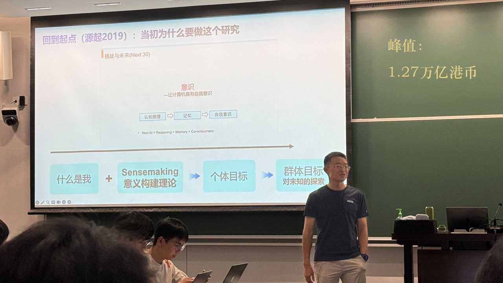

从唐杰身上能看到两点：一是他认为**现在**大模型还没有意识，二是大模型**一定会有**意识，我们只是在路上。

### 塑料网有意识吗：万物有灵论与 IIT

再走极端：一个塑料网有意识吗？当然没有。但刘嘉放了一段视频后，问大家「有没有那么一丝一毫的动摇」。学术圈里专门有个词叫**万物有灵论**，其核心代表理论是 **IIT（整合信息理论，Integrated Information Theory）**：

> 当信息复杂到一定程度，万事万物都可以产生意识，**意识并非生物所独有**。

塑料网没有意识，是因为复杂度不够；复杂度够了就一定产生意识，这个复杂度由 **Φ（phi，整合信息量）** 定义。IIT 不是边缘观点，而是当前意识领域**占据最主流、有最多实验支持**的理论。

但另一批心理学家非常愤怒，专门写了篇文章标题就叫**「IIT 理论是伪科学」**，太难接受「一个塑料网只要足够复杂就有意识」。

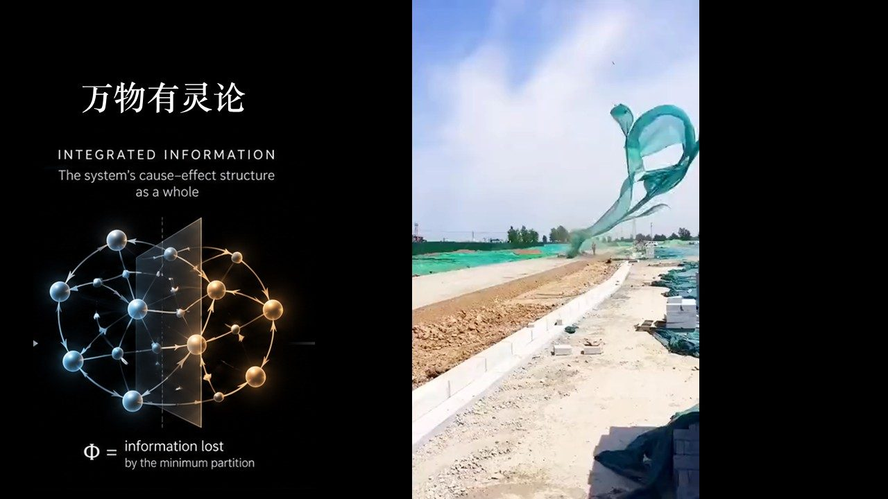 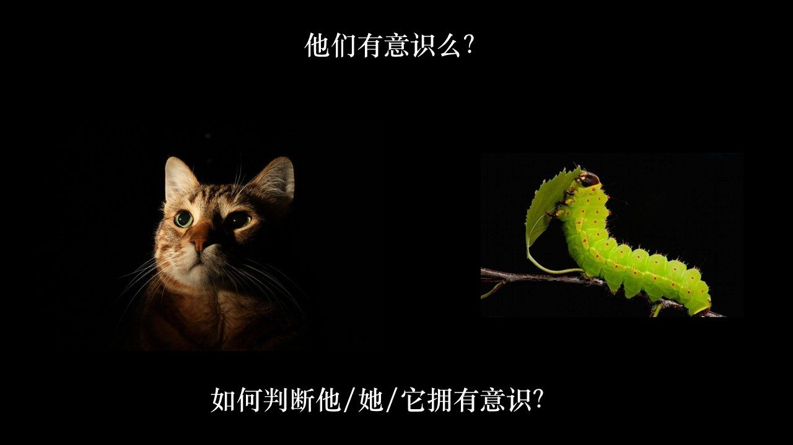

于是问题回到原点：猫有意识吗？毛毛虫有意识吗？无论你答有还是没有，都要回答一个更基本的问题，**你的判断标准是什么？** 不能拍脑袋说「我觉得有、我觉得没有」。

**本节要点**
- 意识的追问从猫、毛毛虫，推进到大模型、塑料网。
- 伊利亚·苏茨克维认为大模型「有一丝意识」，这导致他与奥特曼分裂并主张加强安全；辛顿认为 AI 已有主观体验；唐杰把「让计算机有自我意识」定为未来 30 年目标。
- 万物有灵论 / IIT 认为复杂度足够即可产生意识，意识非生物独有；但遭部分心理学家批为伪科学。
- 核心难题：判断「有没有意识」的标准是什么？

---

## 06 意识为何不可测：颜色是一种心理量

`00:53:21` - `00:59:53` ｜ 课件 `slide-19` - `slide-21`

怎么判断意识存在？刘嘉用一朵花切入，区分两种属性：

- **物理属性**：一束光打上去，反射出电磁波，这是客观存在的物理量。
- **心理属性**：颜色。**颜色不存在于物理世界，只存在于心理世界**。物理世界叫电磁波，心理世界叫颜色。

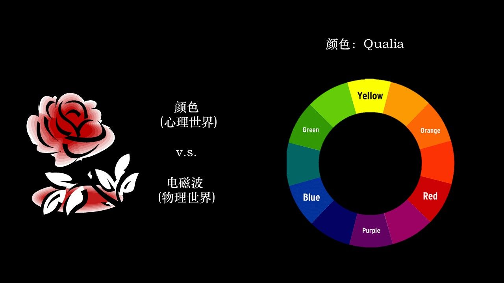

证据很巧妙。电磁波是一维的：红光波长最长，紫光波长最短，两者在可见光谱上**隔得最远**。但在心理世界里，红色和紫色**离得最近**，「大红大紫」。如果颜色只是电磁波的直接反映，红与紫该是最不相像的两个颜色；事实恰恰相反。所以**颜色是一个心理量，电磁波是一个物理量**：一朵花同时有物理属性（取决于客观）和心理属性（取决于谁去看）。

### 皮皮虾与色盲：换个生物看世界

人眼有三种色素细胞，能分辨约一万种颜色。换成**皮皮虾**（螳螂虾）去看这朵花，它有 12 种颜色敏感细胞，能看 11 万种颜色，在它眼里，在座各位都是色盲，那朵花是「爆炸型」的丰富色彩。

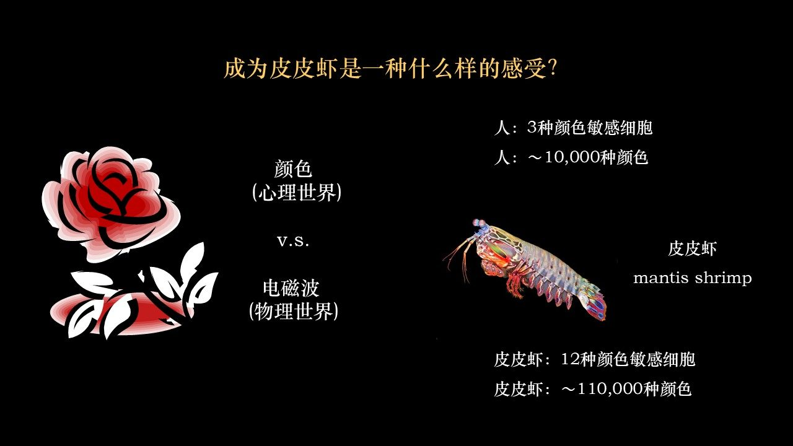

这就回答了上一节的难题：你知道自己有意识，但**你怎么判断别的生物、别的人有没有意识？** 你判断不了，因为感知系统就不一样。你是一个色盲，就永远无法判断全色盲的世界是什么样。所以连「你有没有意识」这件事，我们都很难判断。

**意识是极端主观、极端私有、极端难测的**。你眼睛的色素细胞和我的数量不同，你看到的红色和我看到的红色**一定不一样**；没法达成共识，它取决于你的感官。因此它最虚无缥缈，也最动人心弦。

> 你不会拿着一支粉笔看一个小时，说「这粉笔简直太有趣了」，因为它很客观、不私有、能测量（多少克、多长），所以没有价值。而谈论意识时你觉得「哇哦太神奇了」，正是因为它的虚无缥缈，才把这么多人吸引进心理学。（刘嘉）

**本节要点**
- 一朵花有物理属性（电磁波）和心理属性（颜色）。
- 红紫在色环上最近、在光谱上最远，证明颜色是心理量而非物理量的直接反映。
- 皮皮虾有 12 种色觉细胞、能见 11 万色，说明感知系统因物种而异。
- 意识极端主观、私有、难测，因此判断他者意识几乎不可能，也因此最动人心弦。

---

## 07 意识的两个落点：觉知与控制（棉花糖实验）

`00:59:53` - `01:14:20` ｜ 课件 `slide-22` - `slide-27`

既然意识难直接研究，就从它的**属性**入手。两个属性：

1. **主观经验（subjective experience）/ 觉知（awareness）**：我知道我现在是清醒的、正在讲课；你知道你正在听课。这个偏虚无缥缈（哲学上叫**感受质 qualia**）。
2. **控制（control）/ 自由意志（free will）**：我要做完作业再去玩游戏；这门课是我自己想选，不是老师拿枪逼我选的。这个更落地，也是本课重点。

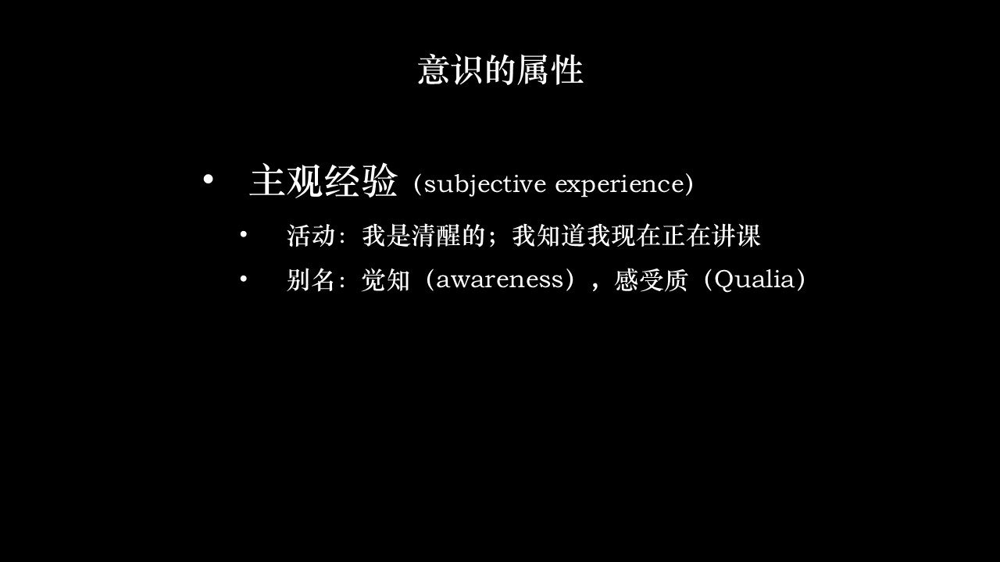 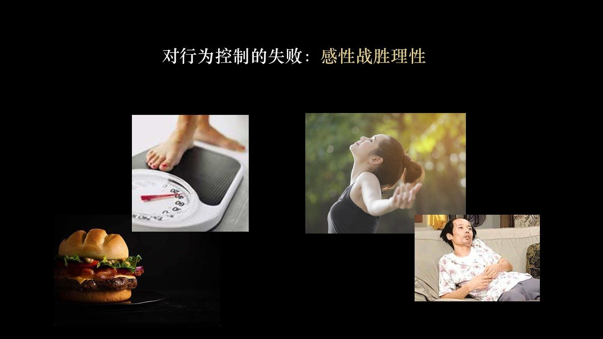

### 控制从哪里开始：棉花糖实验

刘嘉问大家「你怎么考上清华的」，理由五花八门（老师牛、家里有钱、从小补课），但所有人都有一个共同特质，这就是著名的**棉花糖实验**。

实验是这样的：给小朋友一颗棉花糖，告诉他「现在吃只有一颗；等我回来就有两颗」。然后大人离开，看孩子能不能忍住当下吃糖的欲望、等待更大的收获。这种「为了更大收获而抑制当下欲望」的能力，叫**延迟满足（delay of gratification）**。

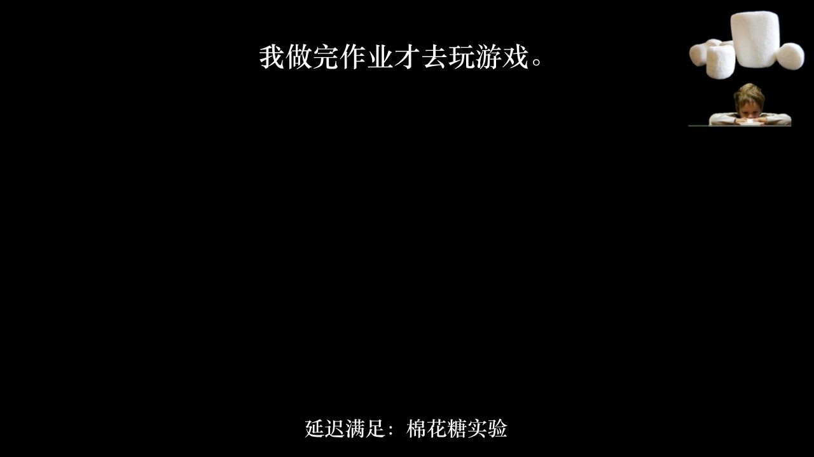

后续一系列研究发现：

> 延迟满足是一个人**事业成功、学业成绩最有效的预测因素**，比家里有没有钱重要得多，比智商高低重要得多。（刘嘉）

在座能考上清华，多半都有这个能力：「我一定要做完作业再去玩。」但这件事对小朋友难，对成人更难。刘嘉举了几个日常例子：减肥的人上秤时恨不得把最后一口气吐出来，看见汉堡还是吃了（「吃饱了才有力气减肥」）；说要拥抱大自然去跑步，结果还是躺下来了。**我们试图用理性战胜感性，但感性常常赢。**

### 理性 vs 感性：人类文明的进化史

人类用极大的毅力让理性战胜感性：

- **奥德赛**：穿过塞壬女妖的海域时，因为歌声会让人着迷，他把自己**绑在桅杆上**，再想动也动不了。这是人类面对诱惑时的「卑微」手段。
- **雨果写《悲惨世界》**：写作时特别不想写、想上街找朋友玩，拖延了进度。后来他每次写作前把所有衣服脱掉交给佣人保管，脱光了就没法穿到街上去，就靠这个办法把《悲惨世界》写了出来。
- **康德**（文艺复兴三大光棍之一，另两位是达芬奇和牛顿）用一辈子苦修写下一段名言：

> 有两样东西，越是经常和持久地思考，它们就越是以日久弥新和不断增长的魔力与崇敬充满心灵，**我头顶的星空和我心中的道德律**。（康德）

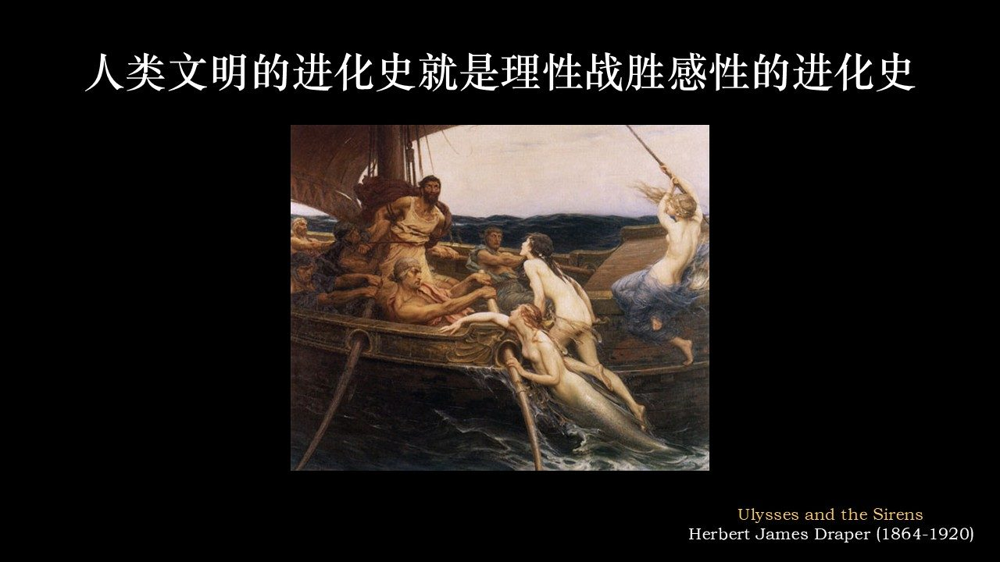 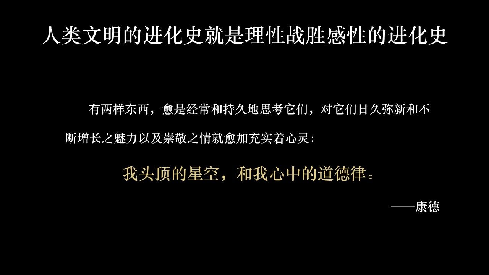

头顶的星空是**宇宙的法则**（宇宙如何一点点演化、终极目标是什么）；心中的道德律是**善恶之分**（什么是善、什么是恶、该追求什么样的生活）。刘嘉笑说高中写作文最爱引用这句话，因为「老师一读就热泪盈眶，不会注意我其他地方写得不通」。

**本节要点**
- 意识两个属性：觉知（主观经验/qualia）与控制（自由意志）。
- 棉花糖实验揭示「延迟满足」是预测学业与事业成功最有效的因素，超过家境与智商。
- 理性常败于感性：奥德赛绑桅杆、雨果脱衣写作，都是人对抗诱惑的手段。
- 康德「头顶的星空与心中的道德律」代表人类理性追求的两极。

---

## 08 白熊实验：越控制，越反弹

`01:14:22` - `01:18:50` ｜ 课件 `slide-28` - `slide-34`

康德那句话很有用吗？刘嘉用一个著名实验给出转折，**白熊实验（韦格纳）**。

### 两个条件

- **条件一**：给你看白熊照片，五分钟内你想什么都行，但每次想起白熊就摇一次铃铛。结果：一开始频率高，慢慢就不想了。
- **条件二**：给你看白熊照片，五分钟内**绝对不能想白熊**。你能控制住吗？大家自信能（「都能考上清华，怎么会控制不住」）。结果：基本还能控制住，你有主观能动性，把念头压下去了。

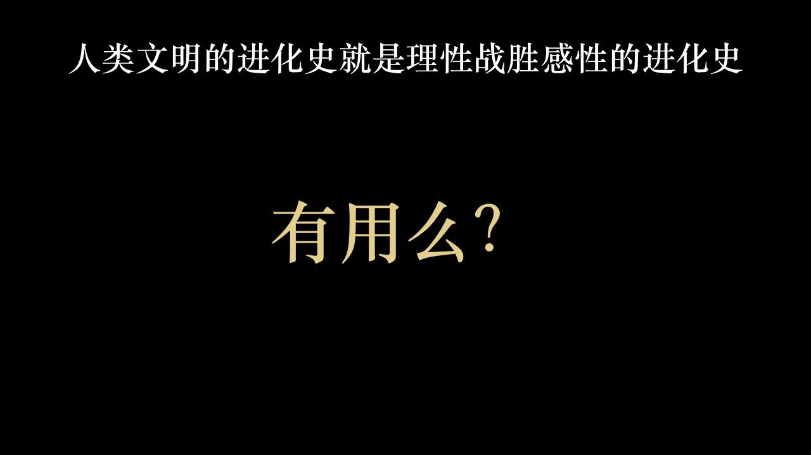 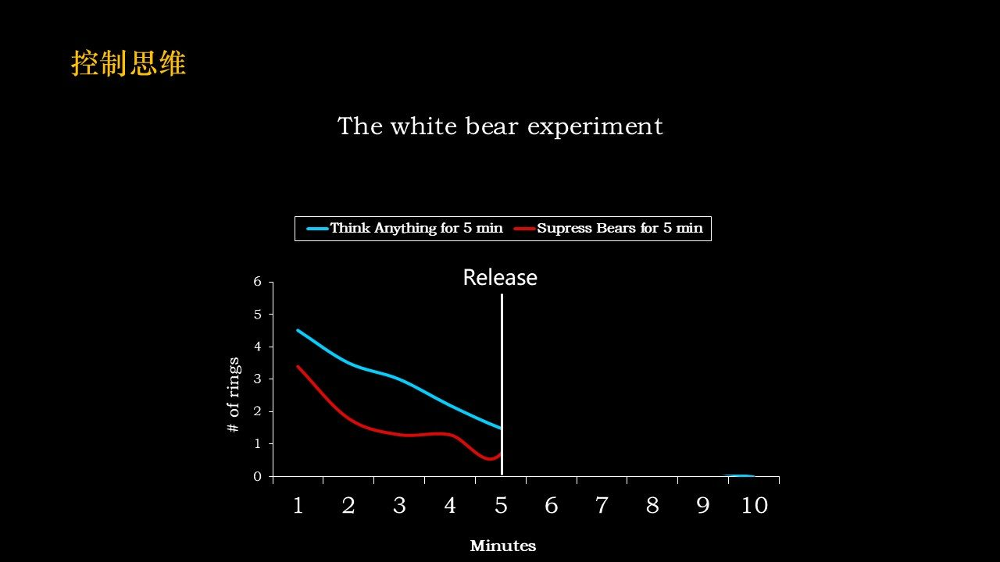

但真正的反转在**五分钟结束之后**：一说「可以想任何东西」，结果是**满脑袋的白熊，去不掉的白熊**，甚至一周后、一个月后还会莫名其妙冒出来。

### 大脑机制：意识抑制 vs 无意识狂发

为什么反弹这么强？刘嘉用一张大脑工作图解释：

1. 指令「想白熊」发到意识；意识说「不行，要压住」，于是有意识地挡住。
2. **无意识**发现「我寄的信没收到，丢包了」，就**多写几封**继续发；意识「魔高一尺道高一丈」继续挡。
3. 问题是**意识的控制极其消耗能量**，五分钟后能量耗竭，控制消失；而无意识还不知道，仍在**哐哐哐**地放白熊。

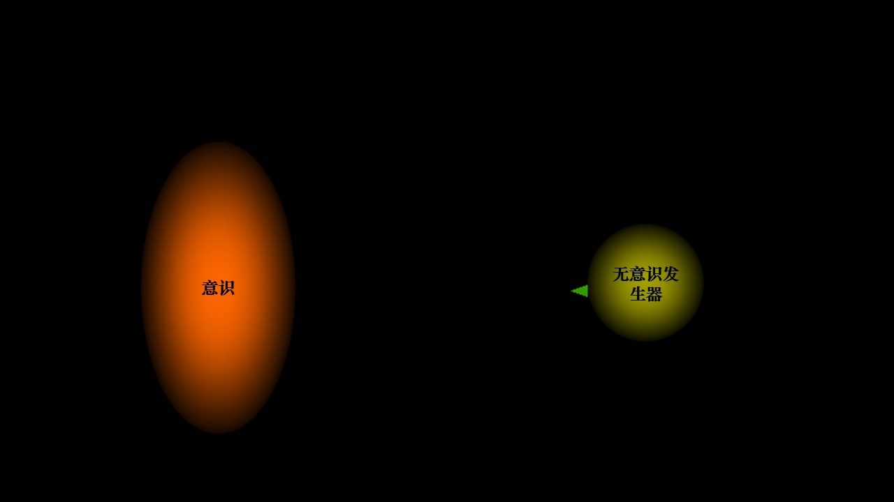 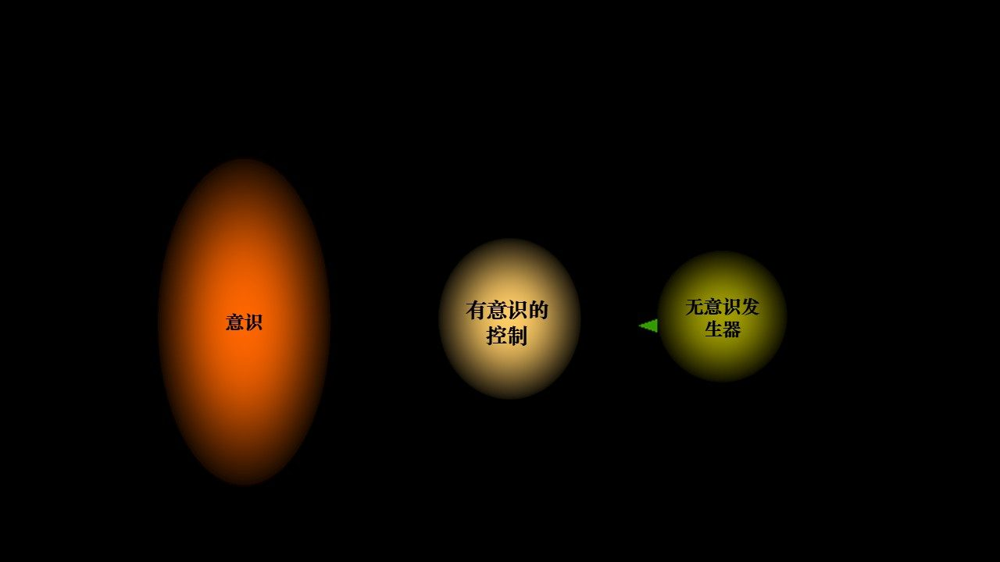

所以结论是：

> 当你越想控制某件事，它的反弹就越重。你的控制只有五分钟，最糟糕的是五分钟之后的反弹，比你想的要强得多。（刘嘉）

伊甸园就是这个隐喻：上帝说不能摘苹果，亚当夏娃于是每天都在想苹果，最后被逐出伊甸园。

**本节要点**
- 白熊实验：抑制一个念头（条件二）后，反弹会比自然状态更强、更持久。
- 机制：意识抑制耗能巨大、终会耗竭；无意识持续「加发」指令，越堵越发。
- 推论：越控制越反弹；伊甸园禁果是同一隐喻。

---

## 09 控制的一生：从虚假控制到失去控制

`01:18:50` - `01:22:26` ｜ 课件 `slide-35` - `slide-38`

把「控制」放大到一生来看。从出生、读书、工作、成家立业、变老到死去，**唯有「控制」二字贯穿始终，也最难**。

- **小时候**：你一闹，父母就来照顾，你以为能控制。这是**虚假的控制**，不是你有本事，是父母怕你闹。
- **读书时**：选课同学没座位，一反映，学校马上打十几个电话要求当天解决，立刻的、及时的回应。这也是**虚假控制**，是学校怕你闹事。
- **进入社会**：你去跟老板说「你这计划有问题、特别弱智」，老板只会说「这小伙子挺有想法」，然后「你被开除了，滚蛋」。这时才发现，社会上的控制才是**真正的控制**。
- **上升期**：努力工作，从组长到部门经理到副总甚至总裁，控制的资源越来越多、管的人越来越多。
- **退休/晚年**：所有能控制的人和资源都没了，开始**失去控制**；对身体也失去控制，躺在床上大小便不能自理，生命走到尽头。

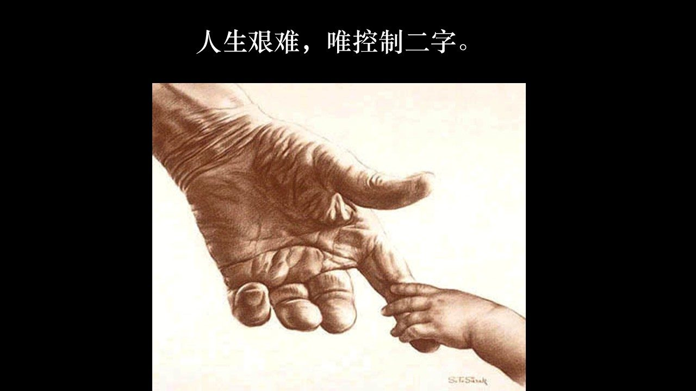 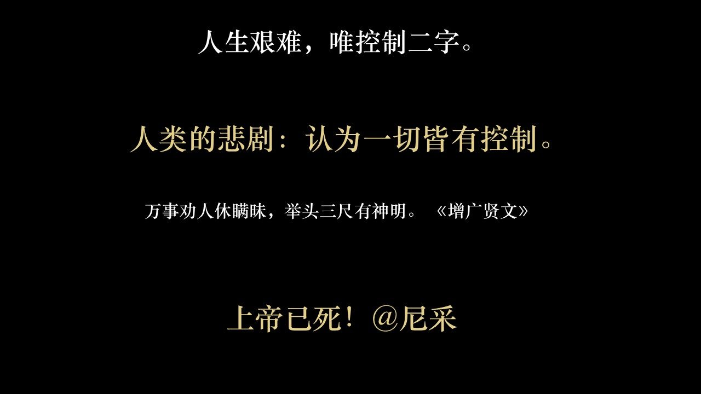

所以人的一生就是**不断获得控制、最终失去控制**的过程，用「控制」两个字即可概括。而人生的悲剧在于：

> 我们总认为「一切皆可控制」，现在控制不了只是能力不够、运气不够、时机不够，有一天终究能控制。（刘嘉）

这正是「正义也许会迟到，但绝不会缺席」「举头三尺有神明」「善有善报、恶有恶报」的底层信念，我们相信有个**神明**在掌控一切、记录善恶。

**本节要点**
- 人一生都在追求控制，最终却必然失去控制。
- 小时候的控制是虚假的（别人让着你）；社会上的控制才是真的。
- 人生悲剧 = 「一切皆可控制」的错觉；这让人投向「神明在掌控」的信念。

---

## 10 尼采：上帝已死，超人与野兽

`01:22:27` - `01:30:09` ｜ 课件 `slide-39` - `slide-41`

「善有善报」需要一个**神明**来兑现。人类历史上都相信神，它提供了一个**因果压缩**：雷电、婚姻、运气、成功，一句「神的旨意」全解决。但尼采在《快乐的科学》里借一个疯子之口喊出，

> **上帝已死。**

这里的「上帝」不是基督教的神，而是西方文明的终极基石，康德说的**道德律**（什么是真、什么是善、人生为什么值得活、苦难为什么有意义）。近代科学把「这个是迷信、那个是错的」逐个击破，**杀死了神**。

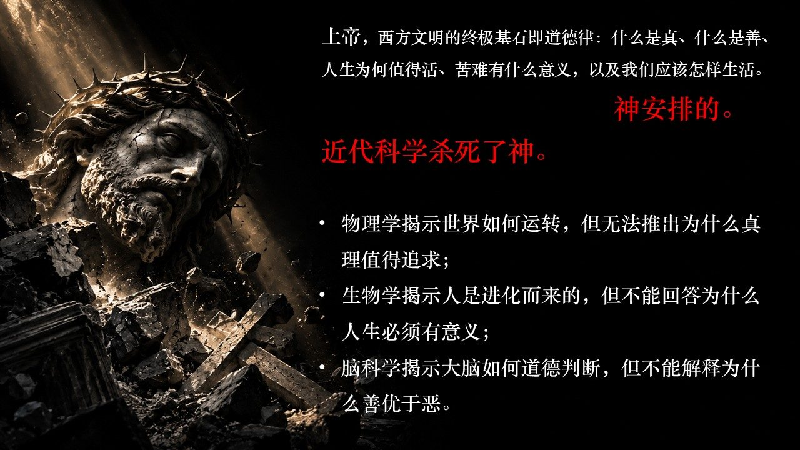

但麻烦在于：科学杀死了神，**却没立一个新的东西出来**。

- 物理学揭示世界如何运转，但没说**什么真理值得追求**。
- 生物学揭示人是进化来的，但没说**人生为什么要有意义**。
- 脑科学揭示大脑如何做道德判断，但没说**为什么要惩恶扬善**。

原来一切都可以「归给上帝」（为什么做这件事？上帝安排的；受了欺负不还手？上帝会惩罚他），心灵瞬间平静。现在上帝死了，真善还得追寻，科学却回答不了「为什么要这样」，人就陷入**迷茫与虚无主义**。

### 超人与野兽

尼采的答案是：一定要有个**超人**。注意，超人不是能力超强的 superman，而是**超越自己的人**。超人有三个特征：

1. 不需要上帝、社会规范、传统习俗、大众评价来告诉自己怎么活，**按自己的方法活**。
2. **接受世界没有预设意义**，能忍受虚无主义（没有天堂、没有来世，仍能接受）。
3. **摆脱固化的自我，重新塑造自己，超越自己**。

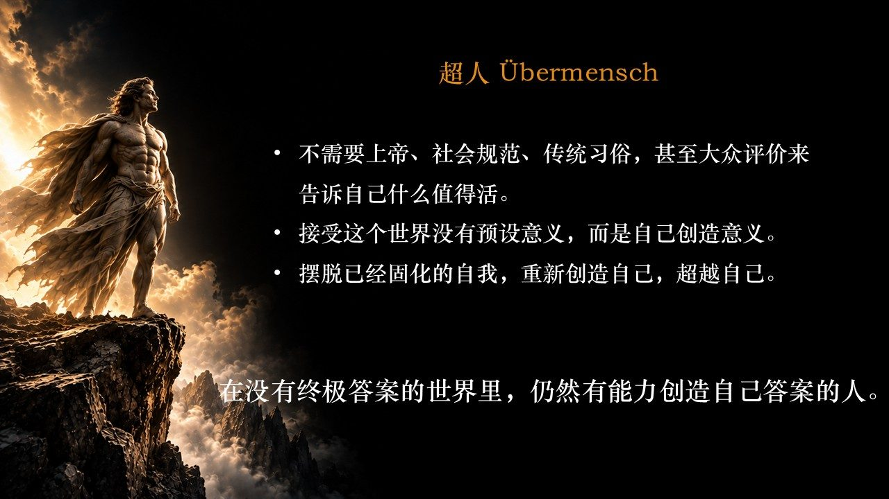 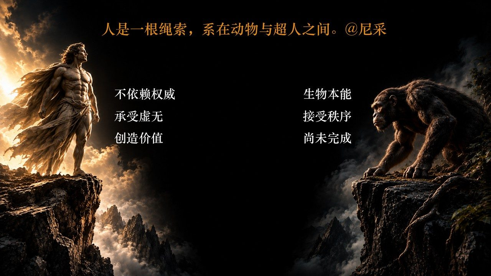

但尼采发现很难，在一个没有答案的世界里自己找答案，太难了。于是他在另一端又放了一个**野兽**：

- 遵循生活本能（饿了吃、被欺负打回去）。
- 接受现有秩序，被动遵守、不主动挑战。
- 处于演化之中，是**未完成**的存在。

> 人是一根绳索，系在动物和超人之间。（尼采）

可惜尼采没想清楚「那根绳子到底是什么」。1886 年他想「我是谁」想得太多，陷入精神分裂，十年后（1900 年）去世。而在他去世的这一年，另一位大牛诞生了，他详细说清了什么是超人、什么是野兽、什么是那根绳子。这个人就是**弗洛伊德**。

**本节要点**
- 尼采「上帝已死」：科学杀死了神（道德律的基石），却没立起新价值，导致虚无主义。
- 超人 = 超越自己的人，三特征：不靠外在规范、忍受虚无、重塑自我。
- 野兽 = 本能、守序、未完成。
- 「人是系在动物与超人之间的绳索」；尼采未能解释这根绳子，留给弗洛伊德。

---

## 11 弗洛伊德：冰山、防御机制、哀伤与抑郁

`01:30:11` - `01:42:49` ｜ 课件 `slide-42` - `slide-49`

尼采去世的 1900 年，弗洛伊德出版《梦的解析》。扉页用拉丁文写着「假如我不能上达天堂，那我将下入地狱」，他对这本书充满信心，说它「直接把以前的人和后面的人分开了」（呼应第一讲的「认知启蒙」）。

### 冰山理论：看见水面下的自己

有了弗洛伊德，人类才第一次真正**看见自己**。以前看到的都是水面上的冰山一角；他让我们看见水面之下、一片黑暗中的**真正的自己**。

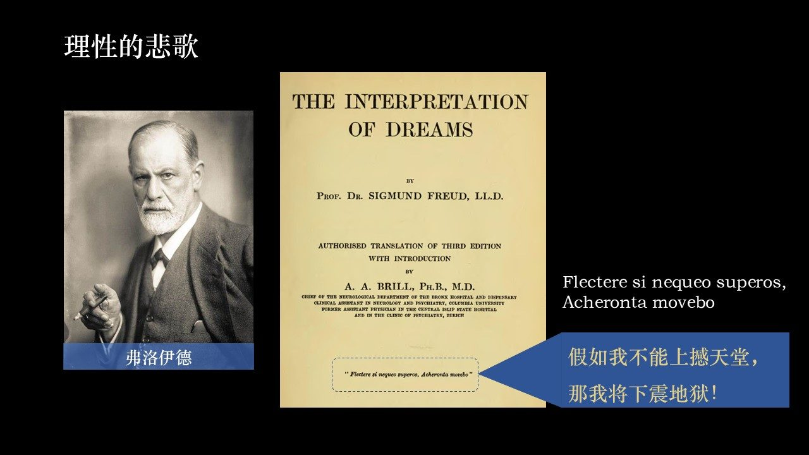 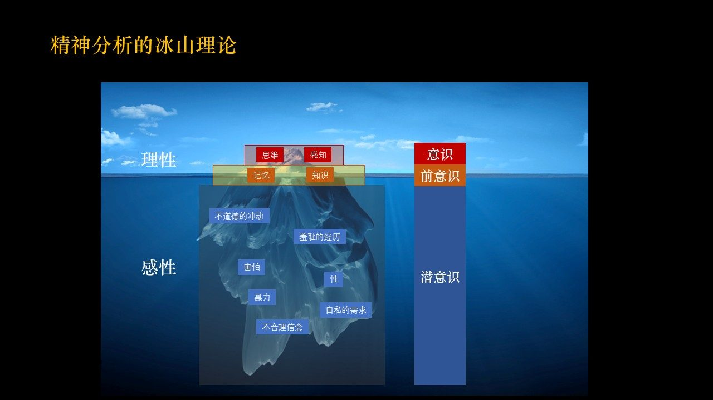

- **水面之上（意识）**：理性、思维、感知，就是康德的道德律、尼采的超人。
- **水面上下交界（前意识）**：记忆、知识，需要时提取。
- **水面之下 80%（潜意识/无意识）**：不道德的冲动、羞耻经历、害怕、性、暴力、自私需求、不合理理念，就是尼采说的野兽、我们的欲望。

> 意识是超人，潜意识是野兽。（弗洛伊德冰山）

于是，「我是谁」里那根绳子清晰了：野兽（欲望、潜意识）与超人（理性、意识）之间的张力。弗洛伊德的贡献就是把尼采抽象的概念**具象化**了。

### 六大防御机制：从野兽进化到超人

人怎样从野兽走向超人？弗洛伊德提出防御机制，前五种是「把野兽按住」：

1. **压抑（repression）**：把野兽压死、不放出来。但白熊实验已经证明压不住，奥德赛把自己绑住都没用。
2. **置换（displacement）/ 取代**：用可接受的行为取代不可接受的。咬手指，其实是小时候吮吸母亲获得温暖，成年后社会不允许，就用咬手指「取代」；「身体和灵魂总有一个在路上」，其实是白日梦的置换。
3. **反向形成（reaction formation）**：恐同症患者往往是同性恋，为了躲避社会歧视，反向形成「坚决反同」来掩藏本质。心理学家给看同性/异性照片测瞳孔（喜欢则放大），嘴上说「有伤风化」，瞳孔却「咵」地放大了。金庸说「不想被人拒绝，就先拒绝别人」，也是反向形成。
4. **投射（projection）**：自己小气，就说「周围人全是小气鬼，就我大方」。辛弃疾「我见青山多妩媚，料青山见我应如是」，也是投射，觉得青山英俊潇洒，是把自我投射到青山。
5. **合理化（rationalization）**：「我都是为你好」。父母打小孩「怕你走上邪路」，其实是把自己的暴力倾向合理化（任何形式打小孩都是错的）；项羽「时不利兮骓不逝」，把失败归给时运，也是合理化。

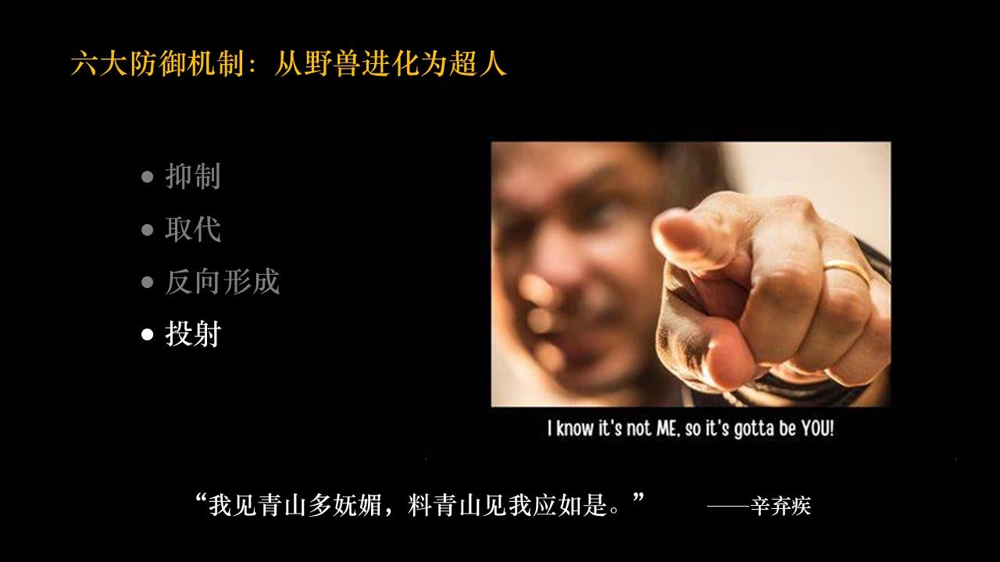 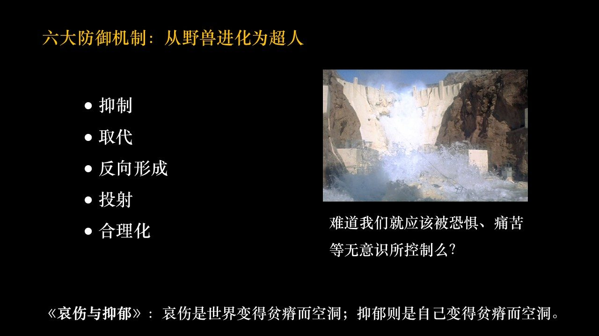

这五种都在试图**藏起野兽、露出超人**，但很多时候不起效。于是有了第六种（下一节详述）：**升华**。

### 哀伤与抑郁：两种不同的痛苦

1917 年弗洛伊德写《哀伤与抑郁》，区分两者，千万不要以为抑郁只是「极度悲伤」：

- **哀伤（mourning）**：来自**外部物理世界**的丧失，朋友去世、丢了一万块钱。「这个物理世界对我太不友好了。」是物理世界变得贫瘠空洞。
- **抑郁（depression）**：指向**内心世界**，对自己不满意、觉得自己不行、不配、对世界是浪费。此时「野兽压不住了，开始吃掉超人」。

> 抑郁症是导致自杀的最大原因。若一个人自杀了，大概有 70%-80% 的概率是因抑郁症。（弗洛伊德）

**本节要点**
- 弗洛伊德冰山：意识（超人）、前意识（记忆）、潜意识 80%（野兽/欲望）。
- 六大防御机制前五种，压抑、置换、反向形成、投射、合理化，试图藏起野兽，但常失效。
- 哀伤来自外部丧失，抑郁来自自我否定；抑郁是自杀主因。
- 《梦的解析》首版十年只卖 600 本，为推广理论，弗洛伊德「碰瓷」达芬奇。

---

## 12 达芬奇与创伤的升华

`01:42:49` - `02:00:15` ｜ 课件 `slide-50` - `slide-57`

《梦的解析》出版后遇冷，十年只卖了 600 本（名字没取好、内容又晦涩）。为推销理论，弗洛伊德决定「碰瓷」文艺复兴第二大光棍，**达芬奇**，用精神分析解读他。

### 达芬奇：天才与消极

达芬奇不只是艺术家，还是科学家，被称为「文艺复兴第一人」，样样顶尖。但他性格消极、漠然、压抑，避免一切对立争议：「一个人没有权利去爱或恨任何事，除非他已完全了解自然本性的所有知识。」（而没人能完全了解。）他高大帅气、一堆女性追求，却是光棍，宣称「与生儿育女有关的任何事都令人厌恶」。这样一个极聪明、极有成就、极帅气的人，却有极其负面的性格与情绪，正好成了弗洛伊德「碰瓷」的对象。

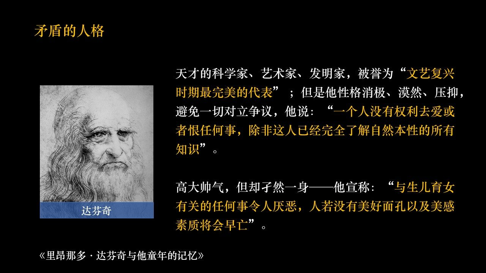 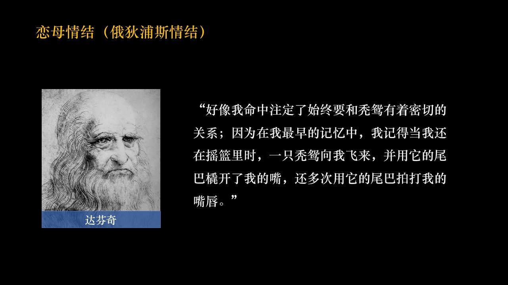

### 恋母情结与蒙娜丽莎

弗洛伊德写《列奥纳多·达·芬奇和他的童年记忆》，一出版就洛阳纸贵（人人都知道达芬奇，也都知道他「怪异」）。他分析说达芬奇有**恋母情结**（俄狄浦斯情结，杀父娶母）：

- 达芬奇自传写「好像我注定始终要和秃鹫有密切关系，摇篮里一只秃鹫飞来，用尾巴撬开我的嘴、拍打我的嘴唇」，弗洛伊德解读为**母亲喂母乳**的意象。
- 达芬奇的出身：父亲是贵族，巡视农场时与农家女有了私生子达芬奇，达芬奇随母生活；几年后贵族把他接回庄园，从此**永远和母亲分离**。五岁时，他童年最美好的时光被夺走。终其一生，他对母亲充满思念、爱恋，甚至把母亲想象成另一半。

> 达芬奇「不值得爱、不值得恨」，因为他已深深爱上了他的母亲。（弗洛伊德的分析）

这种痛苦是有价值的：他不能娶母（违反世俗），只能深深压抑，造成一生痛苦；但他把痛苦**转换成创作力**。于是「终身对母亲的思念与爱恋，最终变成了《蒙娜丽莎》的微笑」。

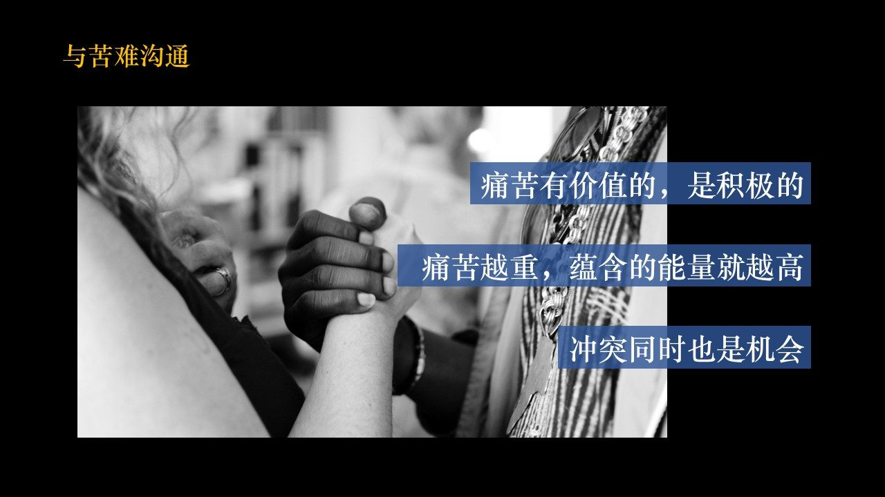 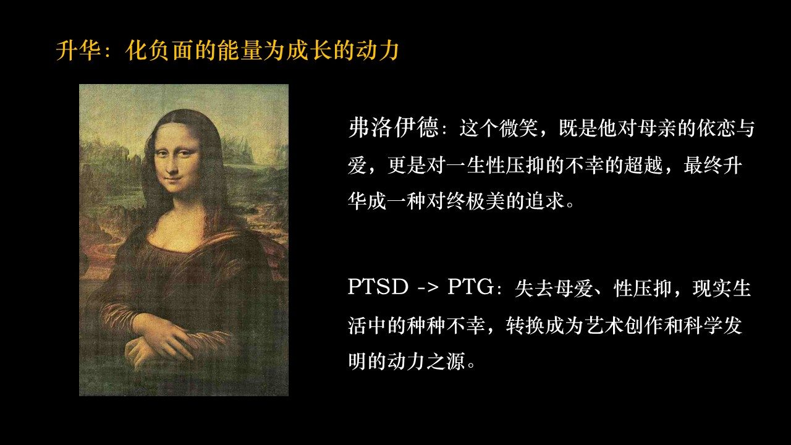

弗洛伊德点睛：蒙娜丽莎的微笑蕴含两个因素，**端庄**（是母亲）与**魅惑**（想娶母）。这幅画是世界上最著名的肖像，不是因为技巧无人能及，而是「注入了百分之百的达芬奇的情感」。

> 这个微笑既是对他母亲的依恋与爱，更是对他一生压抑的不幸的超越，最终升华成一种对终极美的追求。（弗洛伊德）

### 升华：第六种防御机制

这就是现代心理学要做的：把 **PTSD（创伤后应激障碍）** 变成 **PTG（创伤后成长）**，这就是**升华**，弗洛伊德的第六种防御机制。失去母爱、性压抑、现实种种不幸，**转换成了科学创作与发明的动力**。

存在主义先驱**克尔凯郭尔**说「苦难是人类最宝贵的财富」，不是受虐狂，而是说苦难有时会找上你，此时就是成长的机会：

- **宏观层面**：科学发展往往源于对疾病与灾难的应对（大战中存亡边缘爆发极大创造力）；社会进步常伴随对不公与压迫的反抗。
- **个人层面**：每个人都必须面对孤独、焦虑、死亡，这些「迫使我们审视内心、深刻反思信念与选择」，从而找到真正的存在意义与使命。如果活得一直很爽（尼采说的「最后的人」），就不可能思考使命。

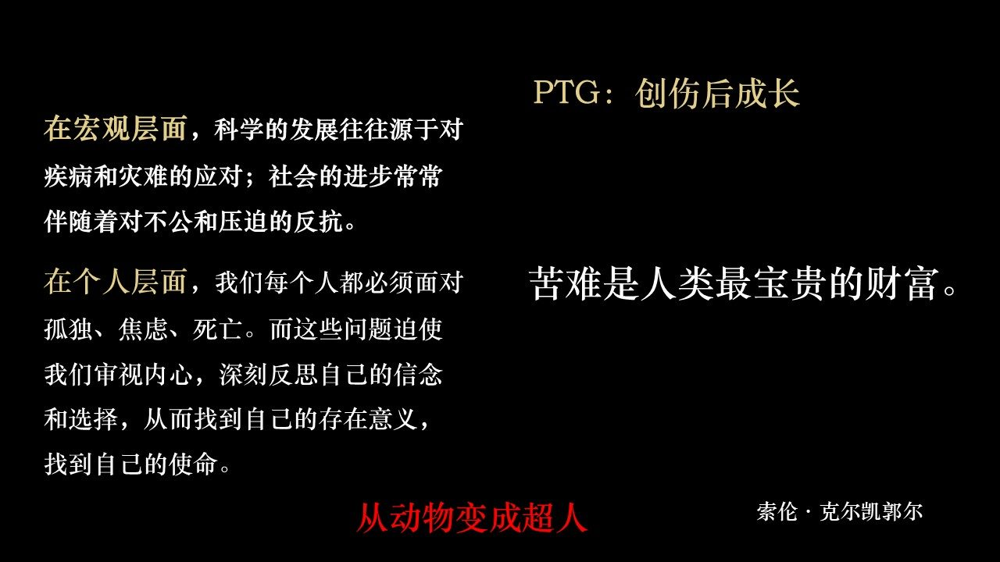 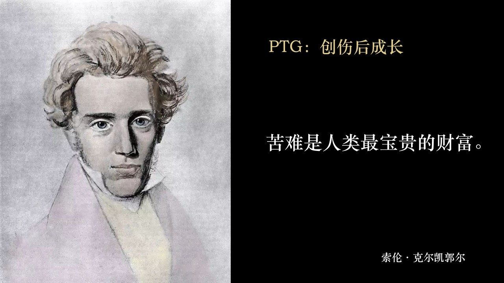

所以：**抑郁源于痛苦，伟大同样源于痛苦**。当你在苦难里，要么在痛苦中毁灭，要么在痛苦中升华，达芬奇选择的是升华。

### 勃艮第葡萄酒：故事的价值

刘嘉用一个故事收束。世界上最贵的葡萄酒是**罗曼尼·康帝**（勃艮第）。他有个有钱朋友请吃饭，摸出一瓶勃艮第酒，说这一瓶 20 万。为什么勃艮第的酒这么贵？呼应第一讲「世界是由故事而非原子构成的」，勃艮第有个极其漂亮的故事：

- 勃艮第在法国东北角，土壤是石灰岩砂石，几乎种不活植物；夏天极热、冬天极寒、气候多变，极难种庄稼。
- 那里有个修道院，僧侣除拜上帝外专心种葡萄，把种葡萄当成上帝的考验，酿成葡萄酒。
- 正是变幻无常的季节给葡萄注入丰富口味，石灰岩注入矿物质，让口味格外丰富。
- 僧侣**酿酒却不喝**（要禁欲），一年只有酒神节那天可品尝一口。禁欲一年、辛辛苦苦种的葡萄，开瓶时芬芳远超任何地方的酒。

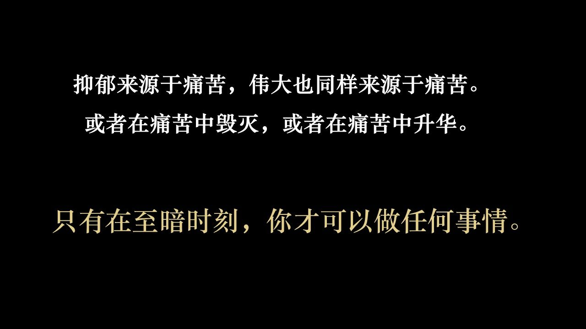 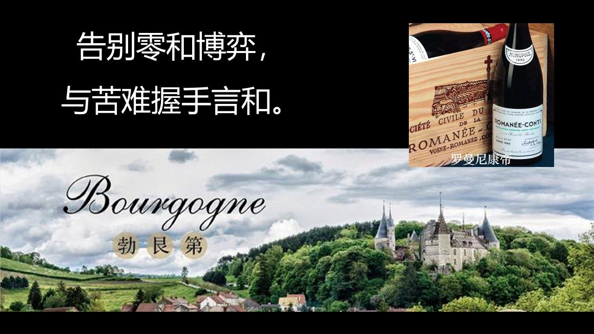

这个故事讲的是：**告别零和博弈**。不要想着「理性战胜感性」或「感性吃掉理性」，它们是同一事物的两面。内心既有超人也有野兽，不必让野兽吃掉超人，也不必让超人打死野兽，而要**让两者和谐共处**，这就是升华，两者终于握手言和。

**本节要点**
- 《梦的解析》遇冷后，弗洛伊德用精神分析「碰瓷」达芬奇，一举成名。
- 达芬奇的恋母情结与母亲分离的童年创伤，压抑后升华为《蒙娜丽莎》的微笑（端庄 + 魅惑）。
- 升华 = 把 PTSD 转成 PTG，把创伤转成创造动力；抑郁源于痛苦，伟大也源于痛苦。
- 勃艮第葡萄酒的故事价值，呼应「世界由故事构成」；升华是超人与野兽握手言和，不是零和搏斗。

---

## 13 自由意志是幻觉：脑电实验与拉普拉斯妖

`02:00:15` - `02:15:57` ｜ 课件 `slide-58` - `slide-69`

讲完无意识，转到意识的另一端，也是它的最高峰，**自由意志**。为什么是最高峰？裴多菲的诗写得最清楚：

> 生命诚可贵，爱情价更高。若为自由故，二者皆可抛。（裴多菲）

裴多菲是匈牙利诗人，俄国入侵、压迫匈牙利时写下此诗。他刚新婚、刚有孩子，却抛家弃子参加战斗，26 岁为自由而死。在他心中，**自由意志比生命、爱情都重要**。但如果告诉你，自由意志只是**幻觉**呢？

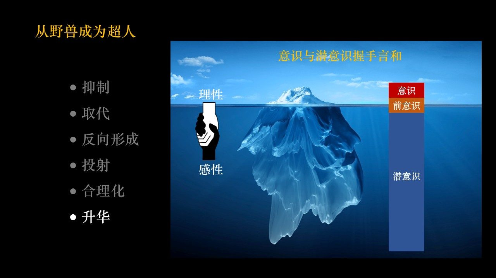 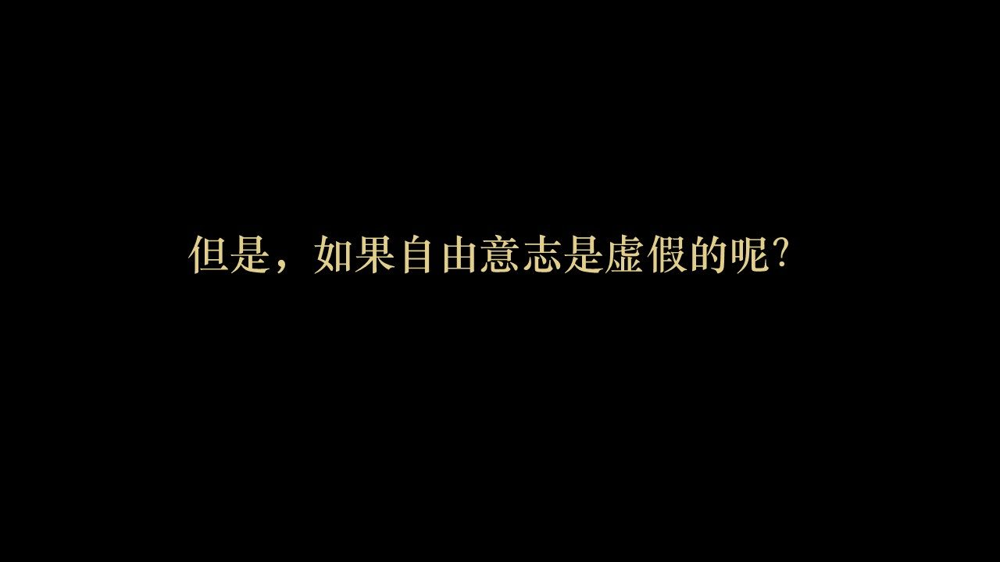

斯宾诺莎有个比喻：

> 人类的自由意志，好比一颗**自以为选择了飞行路线和落点的石头**。（斯宾诺莎）

你只是被抛出的石头，轨迹、每一点都被定死了，但你觉得是自己选的。哲学家说的不太可信？那就看一个**极其震撼的心理学实验**。

### 脑电实验：意识晚于决定

用脑电图（EEG）记录大脑电活动。研究发现「准备电位」，想动手之前，对侧大脑先活跃起来。这符合逻辑：先有大脑活动，手才动。于是用这个标记物做实验：

- 受试者**不用任何计划**，想动手指就动（完全自主驱动）。
- 墙上有个精确的钟，受试者报告「我什么时候想动手指」和「手实际什么时候动」。

倒推（以手指运动时刻为 0）：

| 事件 | 时刻（相对动作） |
| --- | --- |
| **准备电位**（大脑已决定要动） | −535 毫秒 |
| 意识到「我想动手指」 | −200 毫秒 |
| 意识到「手指在动」 | −86 毫秒 |
| 手指实际运动 | 0 |

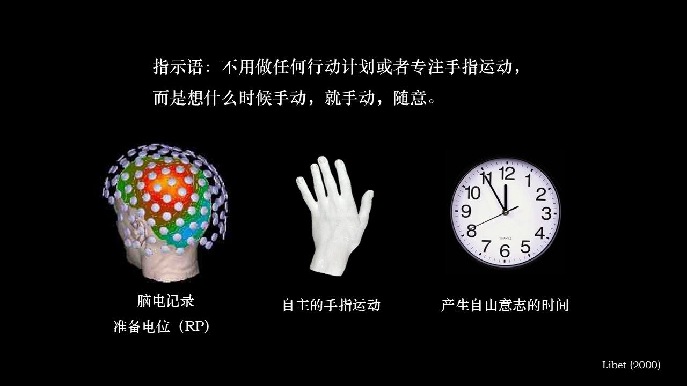 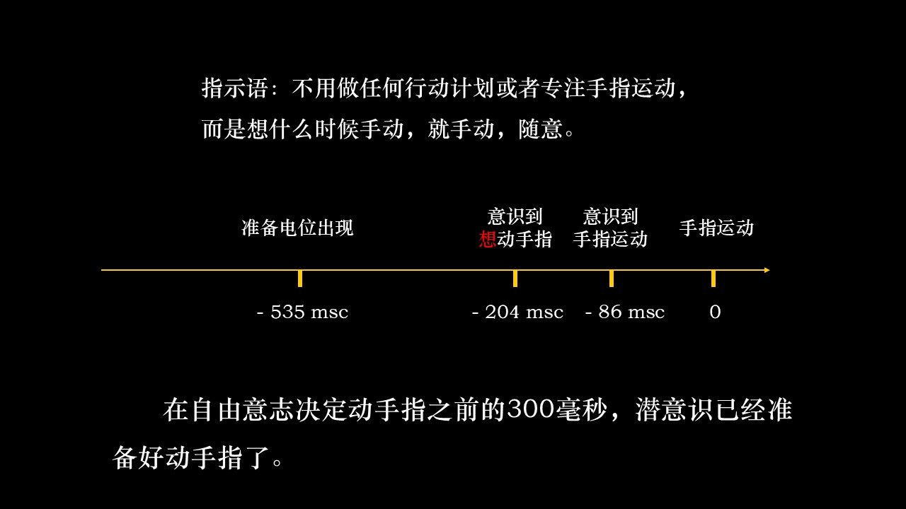

关键点在这儿：**在你「意识到」想动手指之前 300 毫秒，潜意识已经准备好动手指了**。也就是说，在自由意志「决定」动手指之前，大脑已经决定了。

> 我们以为「我想拿水杯，于是拿了」，这只是一个错觉。真实路径是：无意识先决定「要动手指」，然后告诉意识；你觉得是「我」做的决定，那中间的因果箭头是**虚假的因果路径**。（刘嘉）

### 副驾驶比喻

把你自己想成一辆车：**意识/自由意志坐在副驾驶**，有个隐形人（潜意识）在开车。你盯着驾驶员，他往左打方向，车就左转；踩刹车，车就慢下来。你看不见那个开车的人，于是以为「是我在控制这辆车」，还「言出法随」（我说左转就左转）。其实你只是个**观察者**。

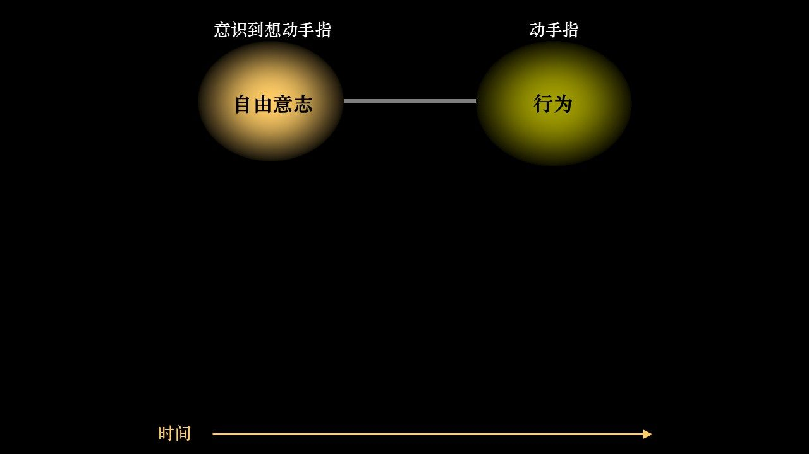

### 拉普拉斯妖：宇宙大爆炸已写好一切

再往前推一步。**拉普拉斯妖**是一个算力无穷大的智者：

> 宇宙的现状是过去的果、未来的因。若有一个智者知道某一刻所有自然运动的力和所有物件的位置，又能分析这些数据，那么宇宙中最大到最小的粒子运动都包含在一个公式里；对它而言没有事物是含糊的，**未来像过去一样展开在面前**。（拉普拉斯）

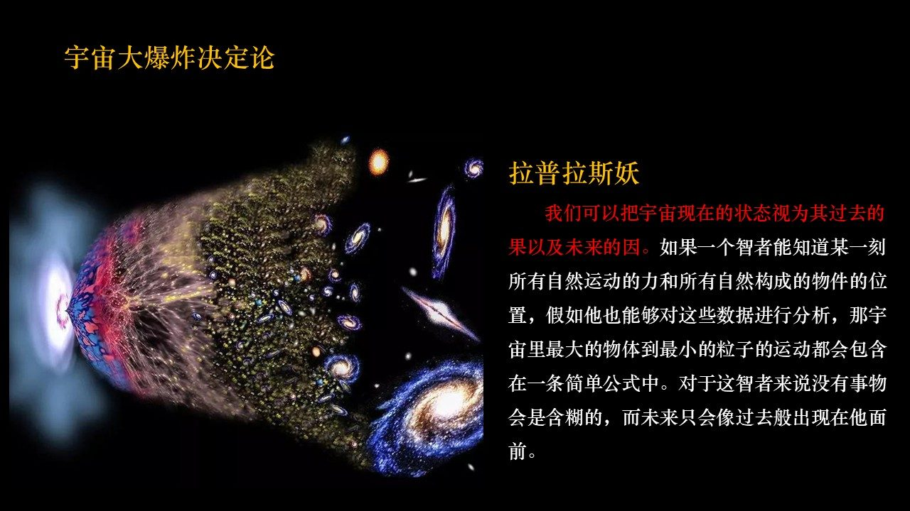

用一个公式：**F(x₀) = x(t)**，t 可以是过去、现在、未来。宇宙大爆炸那一瞬间：

1. 定死了所有**物理定律**（过程不会新增定律）。
2. 定死了所有**初始条件**（每个粒子的位置与方向）。

于是未来可以算出来，这叫**可计算/可归约（computation is reducible）**。就像你存 100 块钱、年息 5%，能算出 100 年后变成多少。只是公式更复杂、初始条件更多，**从概率上是一回事**。

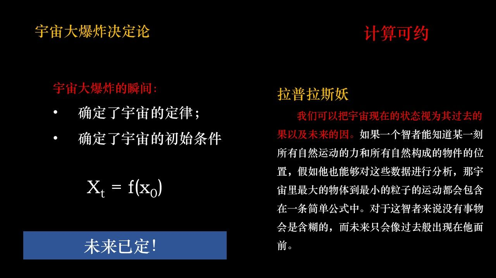

> 我现在说的每一句话、下一刻要说的每一句话、各位辛辛苦苦来听这堂课，在宇宙大爆炸那一刻就已经决定好了。（刘嘉）

推到这一步，自由意志就是虚假的，努力也「没意义」（都定好了）。当然拉普拉斯妖有争议：有人用量子力学反驳（概率增加了一个因素）、有人说「算不过来」，但这不是定论。

**本节要点**
- 自由意志是意识的最高峰（裴多菲「若为自由故，二者皆可抛」）。
- 脑电实验：准备电位（−535ms）早于「意识到想动」（−200ms）约 300 毫秒，说明决定先于意识。
- 副驾驶比喻：意识是观察者，潜意识是隐形驾驶员。
- 拉普拉斯妖：宇宙大爆炸定死定律与初始条件，未来可算；自由意志是幻觉，导致虚无主义（有争议）。

---

## 14 孔雀的尾巴：意识让我们爱上自己

`02:15:58` - `02:21:55` ｜ 课件 `slide-70` - `slide-73`

如果自由意志是幻觉，人怎么找回自主性？刘嘉说，答案要从**孔雀的尾巴**讲起。

### 达尔文的 bug 与性选择

孔雀的尾巴很美，但对达尔文是「致命打击」，他甚至说「我一想到雄孔雀的尾巴就反胃」。因为《物种起源》讲的是适者生存，每一项功能都应服务于生存：

- 无毒的蜈蚣长得鲜艳，是为了吓退天敌（和有毒的混在一起）。
- 但雄孔雀的尾巴纯粹是**装饰性**的，长得大还跑不快、易被捕食，又耗大量能量，这是进化论解决不了的 **bug**。

达尔文晚年终于打上补丁（《人类的由来与性选择》）：雄孔雀花哨的尾巴不是为了飞得更高，而是**让它在雌孔雀眼里更有魅力**。这背后的含义是：这个世界不只**生存**（适者生存是第一步），还要**生活**（活得更好、在异性面前有魅力），这是性选择、第二性征。

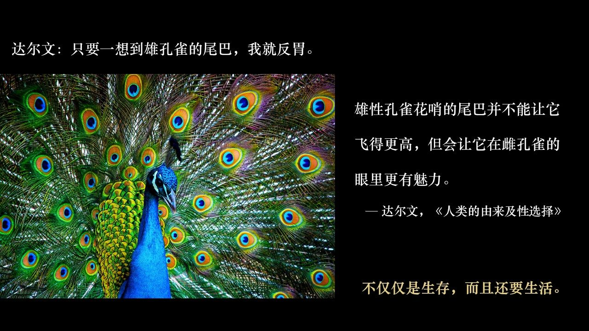 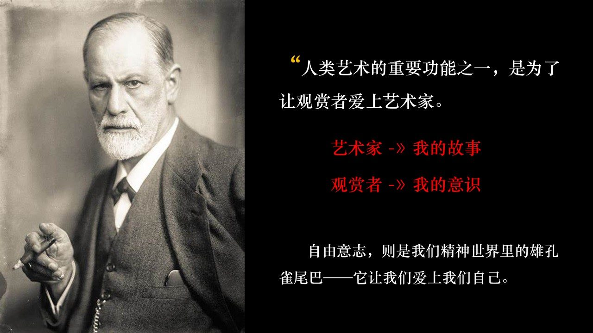

### 艺术的功能：让观赏者爱上艺术家

弗洛伊德敏锐抓住这一点：

> 人类艺术最重要的功能之一，就是**让观赏者爱上艺术家**。（弗洛伊德）

雄孔雀长漂亮尾巴是为了让雌孔雀爱上自己。这里的「艺术家」是隐喻，**艺术家 = 我创造的故事**（我的经历、成就、遇见的人、走过的路）；**观赏者 = 我的意识**。

> 你得有个观众，观众就是意识。意识让我们每个人爱上我们自己。自由意志就是我们精神世界雄孔雀的尾巴，它让我们爱上自己。（刘嘉）

### 回到桥上的人

再看开篇那幅图：河水流动就足够了，为什么桥上还要站一个人？因为河水是你**对世界的感知、你经历的故事**，而**桥上的人是来欣赏这个故事的，他就是你的意识**。他会在桥上看飘过的花多优雅、流过的水多清澈，让你**爱上自己**。

> 意识的功能不是让你「想拿水杯就拿水杯」，那没有意义。意识的本质是让我们每个人都爱上自己。（刘嘉）

**本节要点**
- 孔雀尾巴是进化论的 bug，用「性选择」补上：世界不止生存，还要生活/被爱。
- 弗洛伊德：艺术的功能是让观赏者爱上艺术家；艺术家 = 我的故事，观赏者 = 意识。
- 自由意志是精神世界雄孔雀的尾巴，让我们爱上自己。
- 桥上的人（意识）欣赏河水（经历），这是「自我欣赏」。

---

## 15 意识的三大功能：存在感、自我价值、超越死亡

`02:21:55` - `02:45:38` ｜ 课件 `slide-74` - `slide-82`

意识如何让我们爱上自己、成为「我」？三个功能。

### 一、放大存在感

**1. 疼痛变成「你的疼痛」**。打你一拳，若只有感受细胞，就只是一种疼痛；但意识去体验时，它才变成「你的疼痛」。同样是挨一拳，仇人打你，你愤怒要打回去；爱人打你，是恋人打闹、充满情感；导师打你，你「敢怒不敢言」。**疼痛本身有了意义，这个意义与你密切相关**。外人只看到「被打了一巴掌」，对你却是完全不同的体验。

**2. 把经历连成故事**。只有「我」才能把各种经历连接成一个连续体，成为真正的你。别人读你的简历（初中、高中、进清华）只是流水账；只有你知道初中在哪读、为何被迫转学、和好朋友怎么撕心裂肺，这才构成完整的你。意识像观众一样点评：「这个不错保留，那个下次别这么干」，让「艺术家」不断改变风格。

**3. 建立坐标系**。每个人有两个坐标系：物理世界的坐标系，和**心理世界以我为中心的坐标系**（以我观察、体验、感知这个世界）。所以同一东西，不同人看法完全不同。刘嘉举了「臭鳜鱼」的例子：一位院士特别爱吃臭鳜鱼，把最好的一块夹给他，他觉得「跟屎一样」，又不好拒绝，只好每样菜都躲着，最后等服务员换盘子才解脱。院士很难理解他为什么不吃，他也受不了院士的「好意」，因为**两人的坐标系不同**。

> 意识让你变得独特。你和别人聊不到一块去，是因为坐标系不一样，没必要强迫对方接受你的观点。（刘嘉）

于是有了世界上最重要的一个词，**「我」**。世上没有任何一个词比「我」更重要，没有「我」就啥都不是。当任何人让你放弃爱好、喜欢、习惯时，你要知道他在**伤害你的「我」**。你可以听、也可以不听，最终怎么选，取决于你的观众（意识）怎么看。

**证据：自画像与「我」的消失**。一位画家被诊断出阿尔茨海默症，知道自己会慢慢消失，于是每年给自己画一幅自画像，1996 年还好，1997 年尚可，1998 年开始变形，1999 年已难辨是自画像，2000 年（最后一年）「我」已经消失。阿尔茨海默不是变得弱智，而是**意识消失、不再知道自己是谁**。精神分裂症患者的自画像同样「裂开」，不是肢体分裂，而是**统一的「我」不存在了**。所以：**意识即存在，有意识才有存在**。

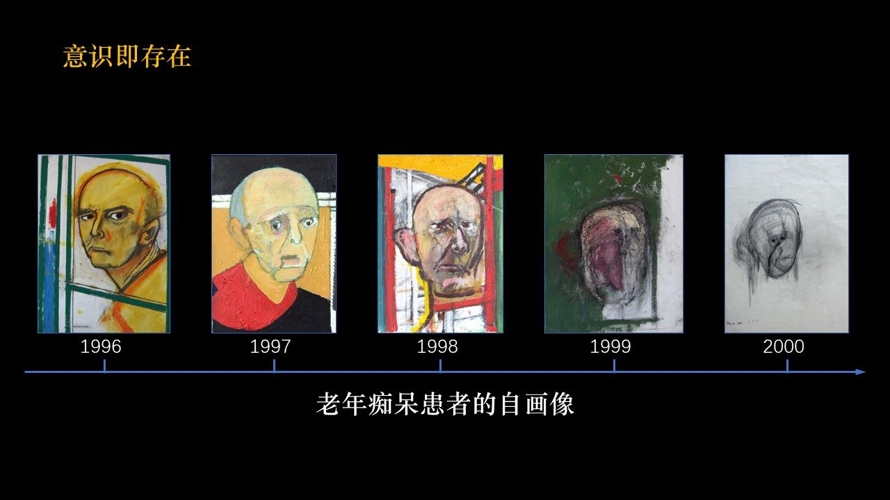 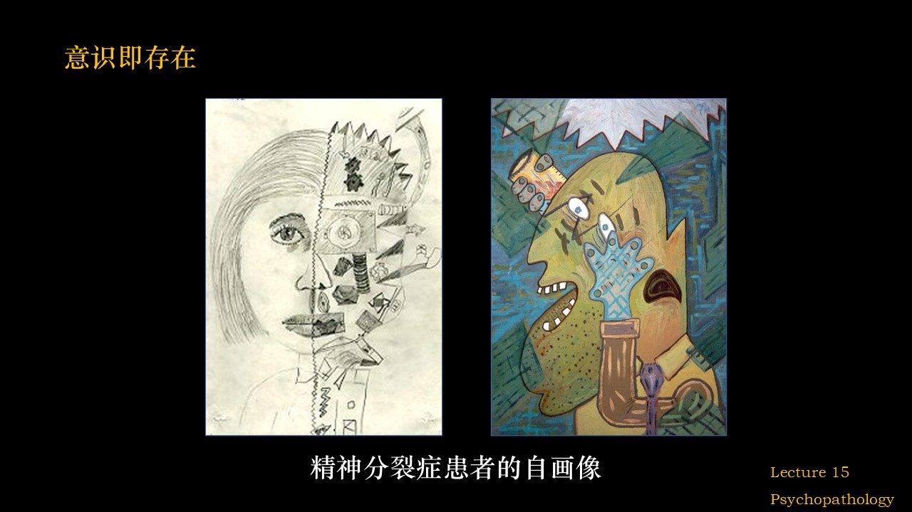

**悖论**：意识越丰富，对死亡就越恐惧。因为你越爱自己，越不忍心看「我」消失。意识让生命真正拥有「我」，也让生命知道**我终将失去我**。人活在最大的确定（一定会死）和最大的不确定（哪天死）之间挣扎，猫狗不会，它们每天吃睡、身体不行了就找个坑死去，一辈子很快乐；人一生下来就知道必死，一辈子都在「我哪天死」的阴影下度过。

### 二、滋养自我价值

动物是**即时满足**（饿了就吃）；棉花糖实验里的小朋友是**延迟满足**（饿了想吃但不吃，因为有两颗棉花糖等着）。高中时同学叫你出去玩，你说「不，我必须做完作业、再加几道题才玩」，为什么？为了上清华。**延迟满足把一种生理欲望，转化成我自己的价值**。

这个价值从哪来？**选择**。而**选择是世界上最奢侈的行为**。刘嘉去给朋友的小孩辅导高考志愿，讲了一整天，结果那孩子是个「学渣」，分数连北京最差的学校都过不了，**学渣是不配有选择权的**。选择本身是奢侈。

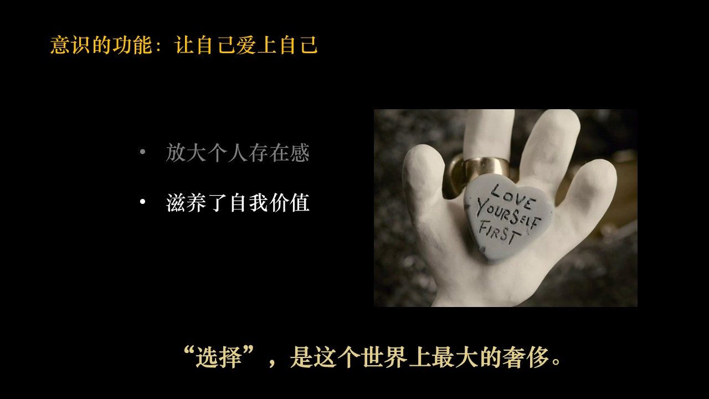

怎么理解选择？刘嘉引用他最爱的电影《黑客帝国》。先知（Oracle）问尼奥「要吃糖吗」，尼奥说「你是预言家，已知我吃不吃，何必问我」。先知说了一句极有哲理的话：

> 你到这里来不是来做选择的，你已经做完选择了。你到这里来，只是来**理解**你为什么做这个选择。（《黑客帝国》先知）

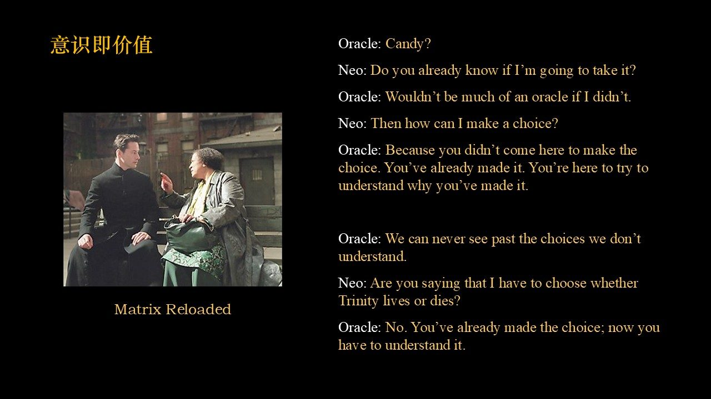

一个 trick：假设两个女孩（A、B）追你，只能选一个，越列清单越乱。很简单，抛硬币，头朝上选 A、尾朝上选 B。硬币抛起、你脱口而出「头朝上」，**行了，你已经有答案了**。硬币是随机的（各 50%），但你说「头朝上」的那一刻，潜意识其实**已经做了选择**，只是你不知道。所以不用看硬币结果，先知那句话的意思就是：你早就选了，只是不知道选了哪个，抛硬币帮你**理解**你的选择。

> 潜意识（水下 80%）已经帮你决定好了；意识的职责是来**理解**潜意识为什么这么做。（刘嘉）

选择如何展开人生？刘嘉画了一幅**平行宇宙**图：每做一个选择，就迈入另一个平行宇宙。你选了清华，就必然看不到北大的清晨。为什么选清华不选北大？是分数高低，还是别的因素？**你的价值决定了你的选择，选择引发你的人生**。

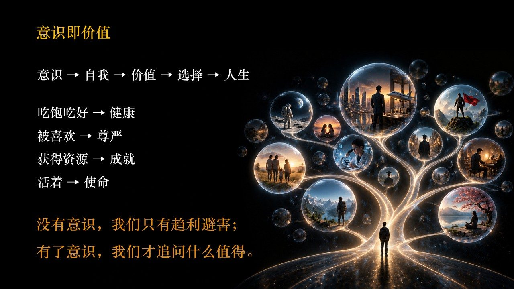

这就是从野兽到超人的进化：原来「吃饱吃好」就行（野兽能吃就不错）；现在你**选择不吃肉、啃草**，不是为了味道，而是为了健康。再看「舔狗」：初级舔狗是希望女神对自己笑一笑、感受到爱；高级舔狗是**寻找尊严**，阿德勒说的「**我爱你，但与你无关**」，对你好不需要回报、不需要你爱回来。有了选择与价值判断，人就从野兽追求的基本需求，进化到追求**健康、尊严、成就、使命**。

> 没有意识，我们只有趋利避害；有了意识，我们才追问「这么做为什么是值得的」，别人看来愚蠢，你看我「舔」得可爽。（刘嘉）

### 三、超越死亡的恐惧

前面说意识越丰富、死亡越尖锐；但意识也**超越了死亡恐惧**。为什么？

**死亡意识是人所独有**，动物没有，AI 也没有（AI 可永生：GPU 坏了换一块、硬盘坏了换一块；人的血管烂了就真走了）。但这是**好事**。乔布斯说：

> 没有人愿意死，即使想上天堂，人们也不会为了去那里而死。但死亡是我们每个人共同的终点，没有人能逃脱。事情本该如此，因为**死亡是生命的最后一个发明**，它触动生命的变革、推陈出新。（乔布斯）

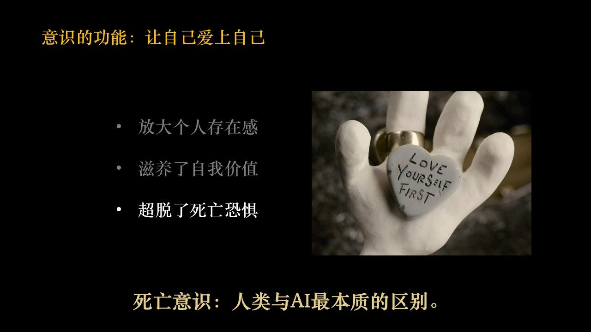 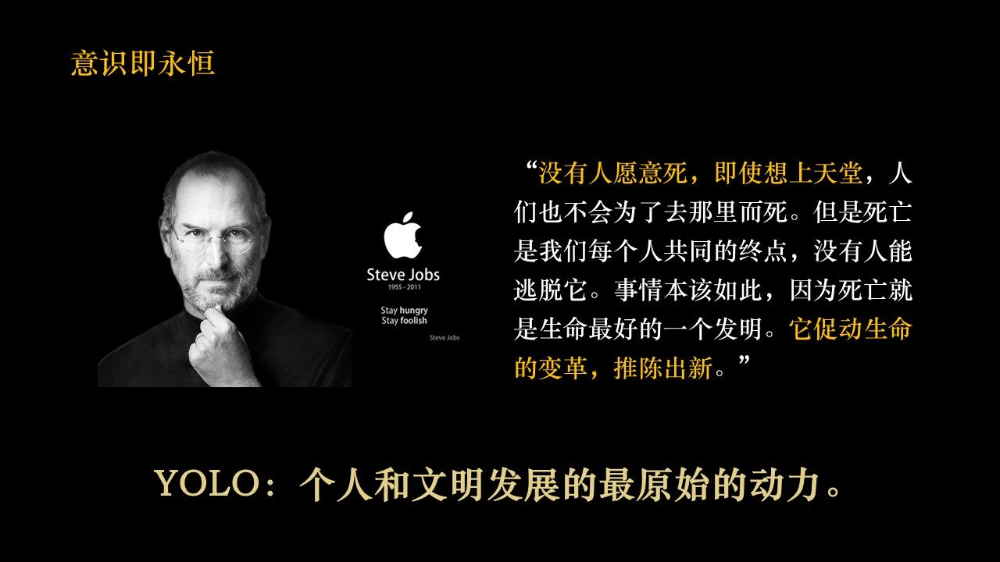

当你知道时间所剩无几，就会想「这件事不能等到明天，一定要现在干掉」。如果你知道自己永生（还能活几千万年），今天着什么急？永远不会有什么大的变化。所以「**你只能活一次（YOLO）**」是个人和文明发展最原始的动力。当你真正相信「只能活一次」，创造力才会极大迸发，不会等下辈子再干。

最后把潜意识与意识合起来：

> **潜意识里的苦难与欲望，提供前行的能量；意识里的爱（爱自己），指引前行的方向。**（刘嘉）

这个「爱」是**爱自己**，不是爱社会、爱别人，因为每个人都是独特的，「我」是世界上最重要的词。所以「只能活一次」（you only have once）才是创造力的根源。

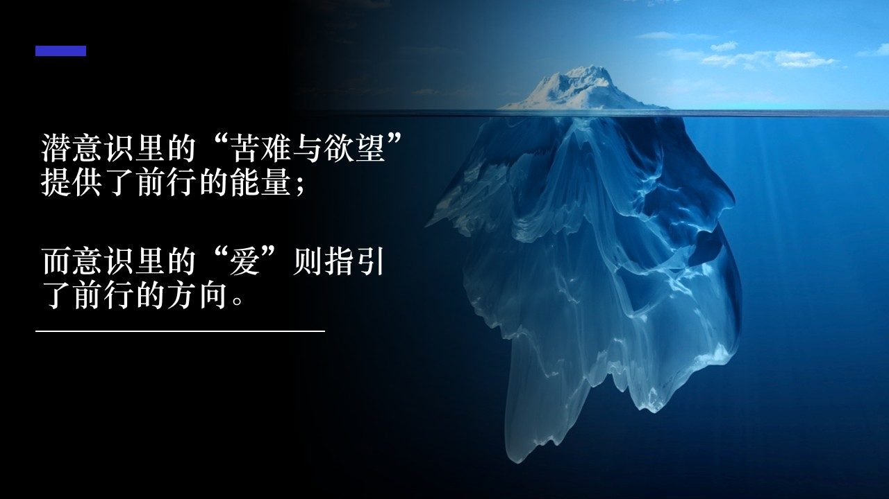

**本节要点**
- 意识放大存在感（疼痛、故事、坐标系），让人独特而有「我」。
- 阿尔茨海默/精神分裂自画像显示「意识即存在」；意识越丰富，对死亡越恐惧。
- 意识滋养自我价值：延迟满足把欲望升华为价值；选择是最奢侈的行为；「你不是来选择，是来理解你的选择」。
- 意识超越死亡恐惧：死亡意识是人独有，「只能活一次」是创造力的原动力。
- 潜意识提供能量，意识（爱自己）指引方向。

---

## 16 什么是意识：磁铁与铁粉

`02:45:49` - `02:49:06` ｜ 课件 `slide-83` - `slide-84`

讲了这么多边角料，「到底什么是意识」？这个问题其实没人真正回答过。有人拿去问现代心理学之父**威廉·詹姆斯**，他没直接回答，而是用**罗密欧与朱丽叶**的故事来讲：

- 罗密欧想要朱丽叶，像磁铁想要铁粉一样，都是极其地「想要」。
- 若两者之间**没有任何阻碍**，他们会不顾一切跑向对方，像铁粉跑向磁铁。
- 但世间总有阻碍，一道墙、一条崎岖的路。

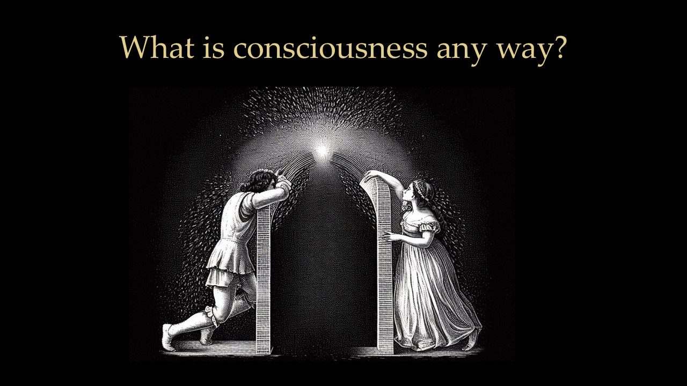

对**磁铁和铁粉**而言，路径是**定死的**，未来取决于障碍：没有障碍就在一起，有障碍就**愚蠢地贴在墙的两边，永远不能相见**。

但对**人**而言，**路径是不定的，目的却是确定的**，罗密欧与朱丽叶会**排除千难万阻、经历千辛万苦，最终一定在一起**，而不是愚蠢地贴在墙的两边。

> **这就是意识。**（威廉·詹姆斯）

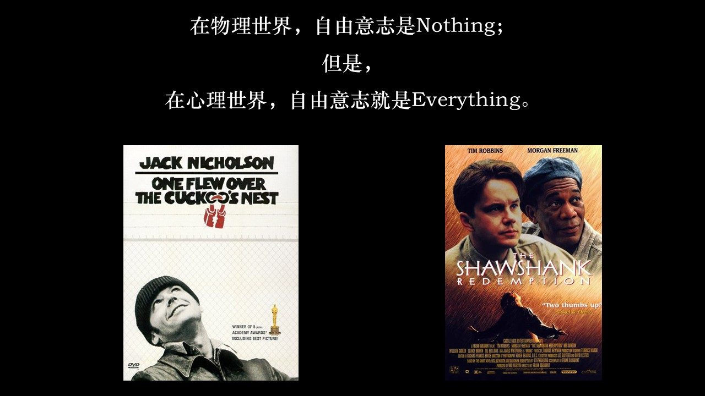

所以结论是：

> 在物理世界，自由意志是 **nothing**（可能是幻觉）；但在心理世界，自由意志是 **everything**。它构成了心理学最核心、最底层的基石。（刘嘉）

这呼应了《飞越疯人院》，所有故事都在讲自由意志，即使丢掉性命也要自由意志。

最后，刘嘉强烈推荐电影**《肖申克的救赎》**（台湾旧译「刺激 1995」）。他说当年在北大最迷茫时，看到这个「译得很烂」的片名不想看，直到有一天实在没得看了才看，结果「人就傻掉了」，「一部电影怎么能拍得如此之好」。

**本节要点**
- 什么是意识？威廉·詹姆斯用磁铁与铁粉作答：磁铁与铁粉路径定死、被障碍困住；人路径不定、目的确定，会排除万难达成目标。
- 自由意志在物理世界是 nothing，在心理世界是 everything，是心理学最底层的基石。
- 推荐电影：《肖申克的救赎》。

---

## 附录 A：课堂时间轴（回放时间点）

| 回放时刻 | 内容 |
| --- | --- |
| 00:20:54 | 开场：意识是心理学最核心概念；人类终极三问 |
| 00:24:22 | 刘嘉误入心理系、读《心灵的激情》 |
| 00:28:48 | 哈姆雷特「生存还是毁灭」；ECMO 与死亡定义 |
| 00:31:56 | 植物人状态；磁共振实验；被囚禁的灵魂 |
| 00:38:12 | 《潜水钟与蝴蝶》；拔管与否；六月后苏醒 |
| 00:42:32 | 威廉·詹姆斯：河流与桥上人 |
| 00:44:20 | 猫、毛毛虫有意识吗 |
| 00:46:40 | 大模型有意识吗（苏茨克维、奥特曼、辛顿、唐杰） |
| 00:49:49 | 塑料网、万物有灵论与 IIT |
| 00:53:21 | 花的物理属性与心理属性；颜色是心理量 |
| 00:56:03 | 皮皮虾与色盲；意识极端私有、难测 |
| 00:59:53 | 意识两属性：觉知与控制 |
| 01:01:05 | 棉花糖实验；延迟满足 |
| 01:10:05 | 理性与感性；奥德赛、雨果、康德 |
| 01:14:22 | 白熊实验；抑制反弹 |
| 01:17:07 | 大脑机制：意识抑制 vs 无意识狂发 |
| 01:18:50 | 控制的一生；虚假控制到失去控制 |
| 01:22:27 | 尼采「上帝已死」；虚无主义 |
| 01:27:05 | 尼采的超人与野兽；人是绳索 |
| 01:30:11 | 弗洛伊德《梦的解析》；冰山理论 |
| 01:33:36 | 六大防御机制（压抑、置换、反向形成、投射、合理化） |
| 01:40:07 | 哀伤与抑郁；抑郁是自杀主因 |
| 01:42:49 | 弗洛伊德「碰瓷」达芬奇 |
| 01:45:25 | 达芬奇恋母情结；蒙娜丽莎的微笑 |
| 01:52:13 | 升华：PTSD→PTG；克尔凯郭尔论苦难 |
| 01:56:20 | 勃艮第葡萄酒与故事的价值 |
| 02:00:15 | 自由意志：裴多菲；斯宾诺莎的石头 |
| 02:02:59 | 脑电实验；准备电位早于意识 |
| 02:07:24 | 副驾驶比喻；拉普拉斯妖 |
| 02:15:58 | 孔雀的尾巴；性选择 |
| 02:18:46 | 艺术的功能：让观赏者爱上艺术家 |
| 02:21:55 | 意识放大存在感（疼痛、故事、坐标系） |
| 02:28:00 | 阿尔茨海默/精神分裂自画像；意识即存在 |
| 02:32:18 | 意识滋养自我价值；《黑客帝国》先知；选择的奢侈 |
| 02:43:01 | 意识超越死亡恐惧；乔布斯；YOLO |
| 02:45:49 | 什么是意识：磁铁与铁粉；推荐《肖申克的救赎》 |

## 附录 B：核心金句

> 有两样东西，越是经常和持久地思考，就越是以日久弥新的魔力充满心灵，**我头顶的星空和我心中的道德律**。 ，康德

> 当你越想控制某件事，它的反弹就越重。 ，刘嘉（白熊实验）

> **人是一根绳索，系在动物和超人之间。** ，尼采

> 人类艺术最重要的功能之一，就是**让观赏者爱上艺术家**。 ，弗洛伊德

> 意识的本质是让我们每一个人都**爱上自己**。 ，刘嘉

> 我们到这里来不是来做选择的，我们已经做完选择了，只是来**理解**我们为什么做这个选择。 ，《黑客帝国》先知

> **死亡是生命的最后一个发明**，它触动生命的变革、推陈出新。 ，乔布斯

> 在物理世界，自由意志是 nothing；在心理世界，自由意志是 everything。 ，刘嘉

> 人类的自由意志，好比一颗**自以为选择了飞行路线和落点的石头**。 ，斯宾诺莎

> **我爱你，但是与你无关。** ，阿德勒

## 附录 C：课件索引（幻灯片播放时刻）

课件按课堂放映顺序命名为 `images/slide-01.jpg` 至 `images/slide-84.jpg`（原编号 P001-P087，缺 P006、P007、P036 三页课堂未放映）。完整播放时刻见 `index.html` 各章配图说明。

| 课件 | 原编号 | 播放时刻 | 主题 |
| --- | --- | --- | --- |
| slide-01 | P001 | 00:00:24 | 封面 L02 CONSCIOUSNESS |
| slide-02 | P002 | 00:22:04 | 人类终极三问 |
| slide-05 | P005 | 00:24:05 | 我是谁最关键 |
| slide-06 | P008 | 00:29:39 | 哈姆雷特 |
| slide-08 | P010 | 00:31:54 | 植物人案例 |
| slide-13 | P015 | 00:42:35 | 河流与桥上人 |
| slide-24 | P026 | 01:01:38 | 棉花糖实验 |
| slide-28 | P030 | 01:14:21 | 白熊实验 |
| slide-42 | P045 | 01:30:16 | 弗洛伊德《梦的解析》 |
| slide-50 | P053 | 01:43:32 | 达芬奇 |
| slide-56 | P059 | 01:56:04 | 勃艮第葡萄酒 |
| slide-62 | P065 | 02:03:03 | 脑电实验 |
| slide-70 | P073 | 02:16:01 | 孔雀的尾巴 |
| slide-84 | P087 | 02:47:38 | 磁铁与铁粉 |

（其余课件见各章配图与 `images/` 目录，播放时刻可由页面时间轴核对。）

---

*本笔记基于雨课堂课堂回顾逐字稿（243 条）与 84 页课堂幻灯片整理。逐字稿由语音识别生成，术语与人名已按 `transcript-cleaned.md` 校正；推理链条完整保留，仅删除课间闲聊与重复表述。课堂回放视频与字幕见 `videos/` 目录（未内嵌于网页）。*